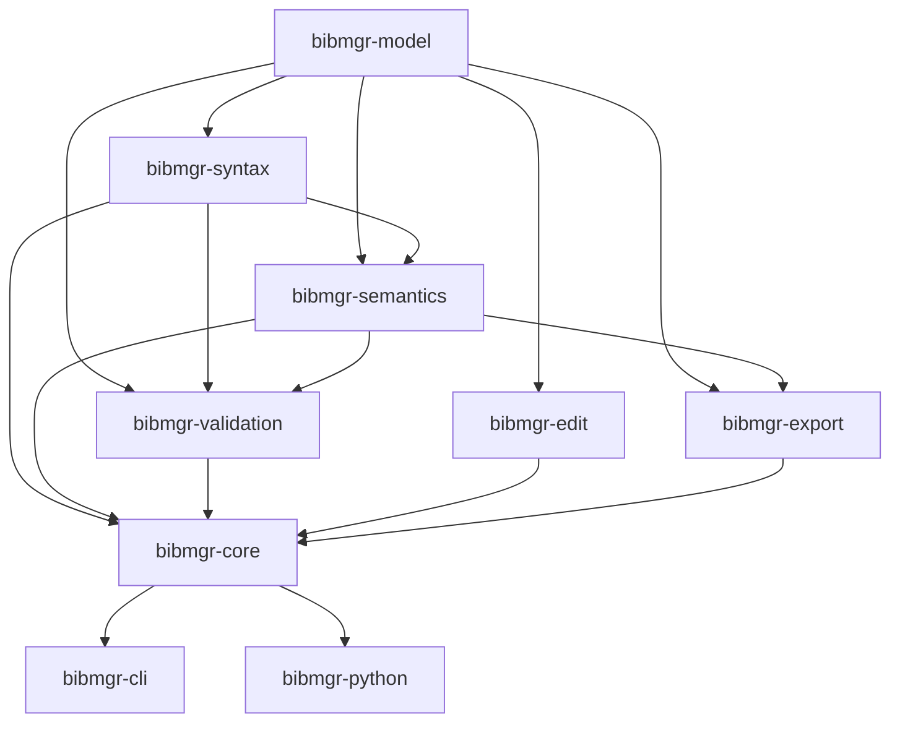
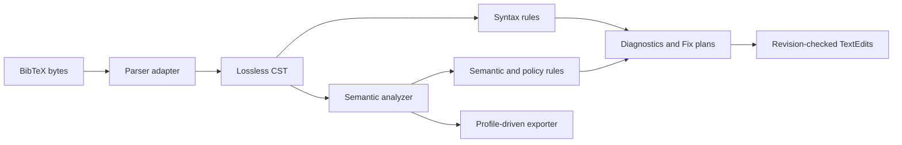

# Architecture

## Scope

The runtime accepts a complete BibTeX document and exposes the same behavior to the CLI, Python backend, and Vue application. `pipeline/` is an independent initialization workflow outside the application and Rust dependency graph. It may read the public library search API, but the application does not accept pipeline JSON or expose a pipeline-specific write endpoint.

## Dependency direction

Arrows mean “is used by.” Crates do not form dependency cycles. Parser backend types never cross the `bibmgr-syntax` boundary, and no adapter depends on `pipeline/`.

The only application boundary available to the independent reconstruction pipeline is the public paginated search endpoint. Pipeline initialization, review, and persistence are operated separately from the browser and application write API.

## Processing model

`bibmgr-core` owns orchestration so an adapter cannot accidentally validate an old semantic model, omit syntax diagnostics, or apply edits without a revision check.

## CST and semantic AST

The concrete syntax tree answers “what bytes and spelling did the user write?” It retains trivia, comments, delimiters, casing, concatenation, duplicate fields, malformed fragments, and ranges. Calling `to_source()` on an unedited document returns exactly the original UTF-8 input, including line endings.

The semantic model answers “what bibliography does this represent?” It normalizes domain concepts such as a work type, people, identifiers, venues, and preprints. It does not contain parser-backend nodes. Every derived value keeps origins, value status, and confidence; unresolved or conflicting values remain explicit rather than being silently overwritten.

After semantic extraction, `bibmgr-core` resolves venue and repository aliases against the embedded, versioned registries. Resolution adds a canonical venue ID, full/short names, and venue kind, or normalizes a repository archive prefix, without discarding the source text and origin ranges. Registry snapshots are therefore part of the deterministic analysis inputs.

A source range is `[start, end)` in UTF-8 bytes. Line and column values are derived only at presentation time. This is particularly important for edits to Japanese names and other multi-byte text.

## Parser isolation

`bibtex-parser` is an implementation detail of `bibmgr-syntax`. An adapter maps its output into the project-owned lossless syntax facade. The original source, tokens/trivia, ranges, and recovery fragments cover any information not represented by the upstream parser. Higher layers depend only on this facade.

The adapter also isolates parser-backend limitations for non-ASCII input while preserving the original UTF-8 source and byte ranges exposed by the project facade. No backend-specific range convention leaks into validation or clients.

This boundary permits an upstream fork, a Rowan or tree-sitter layer, or a replacement parser without changing validation, CLI, Python, or API DTOs.

## Validation and registration

The validation engine receives both CST and semantic bibliography plus a resolved policy. Rule output is sorted deterministically by source range, rule code, and stable diagnostic ID. A diagnostic has two independent dimensions:

- `severity` is how prominently a consumer presents the issue.
- `blocking` is whether the active registration/export policy rejects it.

Registration invokes this engine through `bibmgr-core`; neither the backend nor frontend interprets BibTeX to decide eligibility. A policy may allow an error or block on a warning without changing the rule implementation. Acceptance and storage canonicalization are separate core operations: validation does not mutate the submitted bytes, while `canonicalize_for_storage` applies safe CST edits to a fixed point, revalidates, and verifies that the document inventory was not reduced.

## Fixes and export

A fix is an atomic, ordered set of non-overlapping `TextEdit` values tied to a cryptographic source revision. Application validates the revision and UTF-8 boundaries, applies edits from the end of the document, then re-analyzes the result. Only safe fixes are eligible for unattended application.

Bulk safe fixing may require several atomic plans. The core deterministically selects a non-conflicting batch, applies it, reanalyzes, and plans the next batch against the new revision until reaching a fixed point. Thus overlapping safe suggestions are never forced into one invalid plan.

Export is separate. It serializes the semantic bibliography with an explicit target profile and may choose an entirely different representation, such as `@misc`/`eprint` versus `@misc`/`howpublished`. It is never used for storage canonicalization or a source-preserving quick fix. Conversely, validation never offers deletion of valid metadata merely because an export profile omits that field. For example, a URL remains in the submitted source, canonical laboratory source, and stored semantic record while a target-specific external export may exclude it from generated BibTeX. Ambiguous or conflicting semantics stop export, and the generated representation is revalidated with the export profile's explicit target validation policy.

## Adapter boundary

The CLI is responsible for arguments, files, terminal formatting, JSON output, diff display, and exit status. The PyO3 crate converts stable core DTOs to Python objects, maps typed errors, and releases the GIL around CPU-heavy work. The backend handles HTTP/authentication/transactions only. The Vue client renders DTOs and sends selected fix IDs; none of these layers owns a validation rule.

All machine consumers use schema version 1. Unknown additive fields should be ignored. A breaking rename, changed meaning, or range convention requires a new schema version.

## Determinism and concurrency

For identical source, resolved policy, and registry snapshots, diagnostics, fixes, registration decisions, and exports are byte-for-byte deterministic. Read-only results are shareable. Multi-file CLI analysis may run documents in parallel, but output preserves input order. The first implementation may reanalyze a complete document after an edit; `DocumentSession` keeps that choice private so incremental parsing can be introduced later.

## Failure model

User input does not cause a panic. Parser recovery becomes a diagnostic in tolerant mode; strict mode returns an analysis with blocking syntax diagnostics or a typed error where no useful document can be produced. Configuration, stale edits, conflicts, and exports use distinct typed errors, which PyO3 maps to a stable Python exception hierarchy and HTTP maps to structured error DTOs.

## Further reading

- [Public Rust API](api.md)
- [Configuration](configuration.md)
- [Database and reference API](database.md)
- [Authentication and audit](authentication.md)
- [Production operations](operations.md)
- [Rule authoring](adding-rules.md)
- [Venue registry](venues.md)
- [GUI integration](gui-integration.md)
