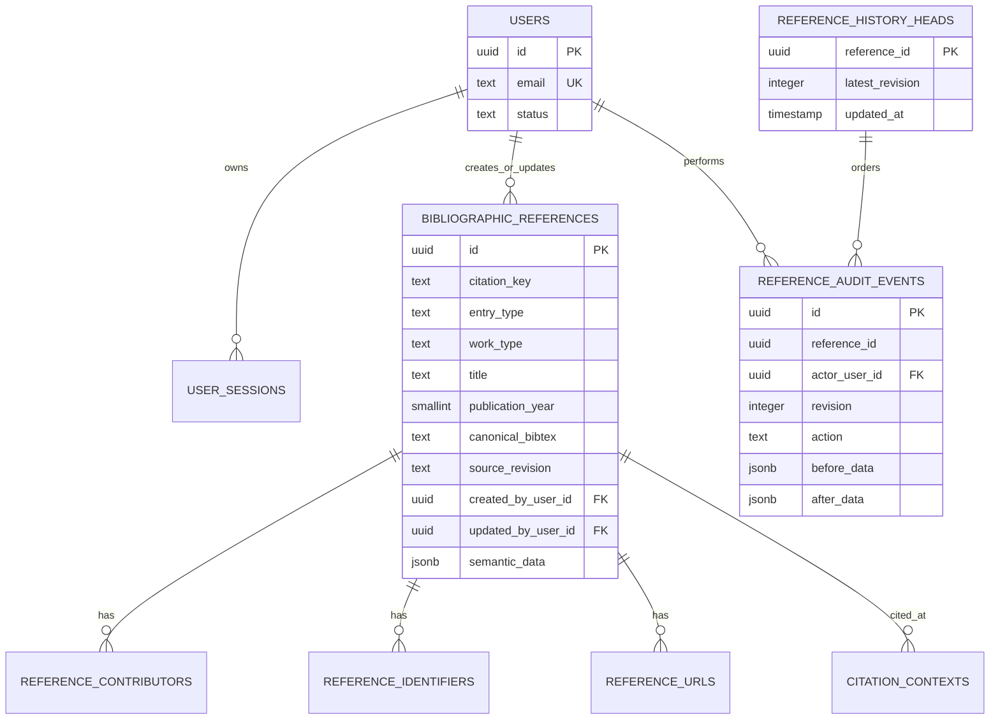

# Database and reference API

## Storage model

PostgreSQL is the source of truth. Stable query and identity fields are relational, the information-preserving canonical laboratory BibTeX entry is stored as `TEXT`, and the complete semantic record returned by `bibmgr-core` is stored as `JSONB`. The JSONB snapshot retains provenance, confidence, unresolved values, and additive fields without making them the only query representation. The physical text column retains the legacy name `raw_bibtex` for migration compatibility, while application code exposes it as `canonical_bibtex`.



Contributors are deliberately reference-scoped. Equal author spellings do not prove that two people are the same person, so the initial schema does not create a global person authority record.

## Identity and duplicates

Normalized DOI and arXiv values have a partial unique index across the library. A conflict returns HTTP 409 and rolls back the whole registration batch. ISBN, ISSN, citation key, and title remain searchable but are not global unique constraints:

- an ISSN identifies a venue rather than an article;
- a BibTeX key is normally unique only within a bibliography;
- title equality can produce false positives;
- author name equality does not establish person identity.

Candidate-level title and author duplicate review can be added separately without weakening the strong identifier constraints.

## Search and pagination

The compatibility list endpoint searches title, citation key, venue, canonical laboratory BibTeX, contributor display name, and identifier values. The primary `GET /references/page` endpoint adds `year`, `author`, `venue`, `identifier`, `entry_type`, `created_by`, `updated_from`, `updated_to`, and stable sorting filters, and returns `items`, `total`, `limit`, and `offset`. PostgreSQL uses `pg_trgm` GIN indexes for partial and multilingual text matching. Every ordering includes a stable UUID tie-breaker, and `limit` is bounded to 100.

## Registration transaction

`POST /references` opens a transaction before invoking the authoritative server-side registration validation. After acceptance, the backend invokes the separate native `canonicalize_for_storage` operation, which applies only safe CST edits, revalidates the result, and rejects a rewrite if its entry, field, string-definition, preamble, or comment inventory changes. The canonical source and its semantic records become the current database value; the submitted source is retained in the audit revision. For a multi-entry document, UTF-8 byte ranges from the submitted and canonical semantic records select the corresponding exact entries. Any invalid native result, information-loss guard, duplicate strong identifier, or database failure rolls back every entry in the request.

The active registration policy comes from `BIBMGR_REGISTRATION_POLICY`. The persistence request cannot choose a weaker policy.

`POST /references/{id}/citation-contexts` appends contexts without changing stored BibTeX and records the resulting complete state as a `context` history revision. The independent initialization pipeline is not exposed through an application registration endpoint.

## Editing and deletion

`PUT /references/{id}` is a complete BibTeX replacement, not a partial metadata update. It accepts exactly one entry, validates it again, and requires the current `source_revision`. This prevents a stale editor from silently overwriting a newer value.

`DELETE /references/{id}` requires the latest source revision in `If-Match`, rejects a stale revision with HTTP 409, and deletes dependent contributor, identifier, URL, and citation-context rows through foreign-key cascades.

All persistence operations require an authenticated user. Creation and update store the current actor on the reference row. Creation, update, citation-context addition, deletion, and restoration advance `reference_history_heads.latest_revision` and append the same numbered `reference_audit_events` row in one transaction.

History snapshot version 2 contains all restorable relational state plus `submitted_bibtex`, `canonical_bibtex`, and the complete semantic snapshot. A delete appends a tombstone whose `after_data` is null while preserving the complete state in `before_data`. Restore accepts both version 2 and legacy version 1 snapshots, where the old `raw_bibtex` value serves as both submitted and canonical source. Because the history head has no foreign key to the live reference, it remains discoverable after deletion.

`POST /references/{id}/revert` accepts a target revision and the caller's observed head revision. It locks the persistent history head, rejects a stale head with HTTP 409, restores the exact target snapshot under the original reference UUID, and appends a new `restore` revision identifying its source revision. Strong DOI and arXiv uniqueness constraints are checked again, so restoration cannot overwrite a conflicting live reference.

Historical revisions are append-only. PostgreSQL has a trigger that rejects `UPDATE` and `DELETE` on `reference_audit_events`; application code has no history mutation endpoint.

## Migrations

Schema changes use Alembic:

```bash
uv run poe db-migrate
uv run poe db-status
```

`uv run poe db-reset` downgrades a local PostgreSQL database to `base` and upgrades it to `head`. It refuses non-local hosts and requires the database name as interactive confirmation. Non-interactive reset additionally requires both `BIBMGR_ENV=development` and `--yes`.

The application never creates or migrates production tables during import or startup.

PostgreSQL migration round trips, `pg_trgm`, strong identifier indexes, partial uniqueness, and the append-only audit trigger are exercised by `backend/tests/test_postgres_integration.py` when `BIBMGR_TEST_POSTGRES_URL` is set. CI supplies a real PostgreSQL 18 service for this test.
