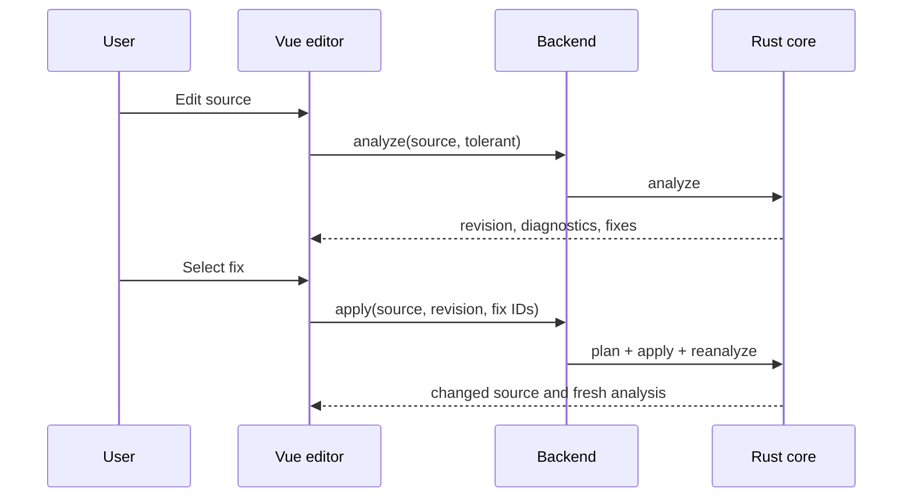

# GUI and backend integration

The integration path is fixed:

```text
Vue -> Python HTTP API -> bibmgr_native -> bibmgr-core
```

The frontend never parses BibTeX to produce diagnostics or decide whether a record can be registered. It may perform transport-level checks such as an empty input or file-size limit.

## Endpoints

The example backend exposes schema-v1 JSON:

| Method and path | Purpose |
| --- | --- |
| `POST /bibtex/analyze` | Strict/tolerant lint and available fixes |
| `POST /bibtex/fixes/apply` | Apply selected revision-bound fix IDs and reanalyze |
| `POST /bibtex/registration/validate` | Authoritative registration decision |
| `GET /bibtex/export/profiles` | Server-owned output profile catalog |
| `POST /bibtex/export` | Profile-driven semantic export preview |

Every request carries `source`; relevant requests also carry `profile`, `policy`, `mode`, `fix_ids`, or `source_revision`. An explicit fix request must send the revision returned by the analysis that exposed its IDs. Every success carries `schema_version`. Errors use a stable code/message DTO and do not masquerade as diagnostics. Transport-level request validation uses `invalid_request` without copying framework-owned input values into the response.

## Editor lifecycle



The supplied validation panel debounces real-time tolerant analysis (350 ms by default). A source or profile change cancels the in-flight request and advances a local generation; responses from an older generation are ignored even if transport cancellation races with completion. The same stale-source check is performed before accepting a fix response, so an edit made while a fix is in flight is never overwritten.

Render a result only when it belongs to the current editor buffer and profile. Core ranges are UTF-8 bytes, whereas JavaScript string and editor offsets are UTF-16 code units. Convert each primary and related range at the view boundary before highlighting; never pass byte offsets directly to `slice`, selection, or decoration APIs.

## Diagnostic presentation

Use `severity` for icon/color/order and `blocking` for the registration state. Display related locations and notes when present. The supplied editor decorates both the primary and same-source related locations, using the most severe overlapping diagnostic for presentation. A fix button uses the fix ID and applicability supplied by the backend. The UI must request confirmation for `requires_confirmation` and must not apply `unsafe` automatically.

## Registration

Before persistence, the backend calls `validate_for_registration` with the server-selected policy inside the same transaction boundary as registration. Client-side validation is advisory because a source or policy can change. When `accepted` is false, return the authoritative diagnostics and keep the editor content. Do not rebuild a decision from HTTP status or severity.

## Export preview

The reference detail presents `Stored source` and `Export preview` as tabs in one BibTeX section. It shows the stored source first and does not load the server-owned profile catalog or call the export endpoint until the export tab is opened. After the first opening, switching tabs preserves the selected profile and generated result until the reference changes. The export panel selects `laboratory` when available and calls the dedicated export endpoint whenever the source or profile changes. Both representations use the same BibTeX syntax tokenizer and token colors as the registration editor, while copy and `.bib` download use the exact underlying source rather than rendered HTML. Export warnings are displayed without changing the stored raw BibTeX. Profile and source generations are checked when each request completes, so a stale response cannot replace a newer preview. Profile choice changes representation, not citation identity.

## Frontend modules

`frontend/src/types/bibtex.ts` mirrors the stable DTO subset, and `frontend/src/api/bibtex.ts` owns transport. Components consume those modules; they should not add regex-based validation rules. The API base URL and optional API key use the same environment configuration as registration. `frontend/src/utils/bibtexDiagnostics.ts` is the single UTF-8-byte to UTF-16-index conversion boundary used by editor diagnostics.
