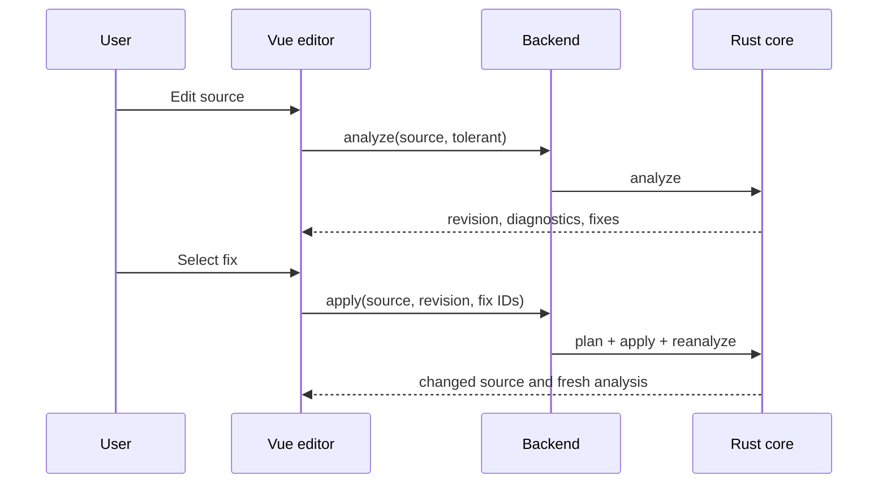

# GUI and backend integration

The integration path is fixed:

```text
Vue -> Python HTTP API -> bibmgr_native -> bibmgr-core
```

The frontend never parses BibTeX to produce diagnostics or decide whether a record can be registered. It may perform transport-level checks such as an empty input or file-size limit.

## Endpoints

The example backend exposes schema-v1 JSON:

| Method and path | Purpose |
| --- | --- |
| `POST /bibtex/analyze` | Strict/tolerant lint and available fixes |
| `POST /bibtex/fixes/apply` | Apply selected revision-bound fix IDs and reanalyze |
| `POST /bibtex/registration/validate` | Authoritative registration decision |
| `POST /bibtex/registration/canonicalize` | Information-preserving laboratory storage preview |
| `GET /bibtex/export/profiles` | Server-owned output profile catalog |
| `POST /bibtex/export` | Profile-driven semantic export preview |
| `POST /auth/email/start` | Send a passwordless login code |
| `POST /auth/email/verify` | Verify a code and create a session |
| `GET /auth/session` | Restore the current browser session |
| `POST /auth/logout` | Revoke the current session |
| `GET /references` | Search or list persisted references |
| `GET /references/{id}` | Fetch one persisted reference |
| `GET /reference-history` | List histories, including deleted references |
| `GET /references/{id}/history` | Fetch ordered revisions and operators |
| `POST /references` | Atomically validate and register BibTeX |
| `PUT /references/{id}` | Revision-checked replacement |
| `DELETE /references/{id}` | Delete a reference |
| `POST /references/{id}/revert` | Restore a prior state as a new revision |

BibTeX processing and reference reads are public. Reference registration, replacement, and deletion require the HttpOnly session cookie plus the session-bound `X-CSRF-Token`. The frontend restores that token from `GET /auth/session`; it never stores a reusable API key.

History reads require login because they include actor email addresses. The history catalog retains deleted reference IDs and titles. Restoring sends both the selected revision and the currently displayed head revision; `stale_reference_history` means the client must reload rather than retry with an obsolete head.

Every request carries `source`; relevant requests also carry `profile`, `policy`, `mode`, `fix_ids`, or `source_revision`. An explicit fix request must send the revision returned by the analysis that exposed its IDs. Every success carries `schema_version`. Errors use a stable code/message DTO and do not masquerade as diagnostics. Transport-level request validation uses `invalid_request` without copying framework-owned input values into the response.

## Editor lifecycle



The supplied validation panel debounces real-time tolerant analysis (350 ms by default). A source or profile change cancels the in-flight request and advances a local generation; responses from an older generation are ignored even if transport cancellation races with completion. The same stale-source check is performed before accepting a fix response, so an edit made while a fix is in flight is never overwritten.

Render a result only when it belongs to the current editor buffer and profile. Core ranges are UTF-8 bytes, whereas JavaScript string and editor offsets are UTF-16 code units. Convert each primary and related range at the view boundary before highlighting; never pass byte offsets directly to `slice`, selection, or decoration APIs.

## Diagnostic presentation

Use `severity` for icon/color/order and `blocking` for the registration state. Display related locations and notes when present. The supplied editor decorates both the primary and same-source related locations, using the most severe overlapping diagnostic for presentation. A fix button uses the fix ID and applicability supplied by the backend. The UI must request confirmation for `requires_confirmation` and must not apply `unsafe` automatically.

## Registration

Before persistence, the backend calls `validate_for_registration` with the server-selected policy and then calls `canonicalize_for_storage` inside the same transaction boundary as registration. Client-side validation and canonicalization previews are advisory because a source or policy can change. When either result has `accepted = false`, return the authoritative diagnostics and keep the editor content. When canonicalization changes the bytes, the registration UI shows the laboratory result and requires a second confirmation; persistence still sends the submitted source so history can retain it. Do not rebuild a decision from HTTP status or severity.

`POST /references` accepts the complete submitted source and stores every canonical semantic record in one transaction. The compatibility field `reference` contains the first stored record, while `references` contains the complete batch. DOI and arXiv conflicts reject and roll back the complete batch. Each history revision retains the submitted UTF-8 entry slice, canonical laboratory source, and full semantic snapshot.

`PUT /references/{id}` accepts exactly one entry and requires the current `source_revision`. A mismatch returns `stale_reference` with the current revision, so clients must reload instead of overwriting a concurrent edit.

The reference detail groups `Edit…` and `Delete…` in a compact More menu instead of giving secondary and destructive actions permanent emphasis in the header. The menu lists Edit first and visually distinguishes Delete after a separator. An unauthenticated action opens login instead of attempting a write. Edit first fetches the latest reference, runs the shared validation and information-preserving canonicalization preview, and sends the submitted source with that latest `source_revision`. Delete uses a concise confirmation dialog before calling the endpoint. After either operation, the application updates the selected reference and library list without a full-page reload. A deleted item remains restorable from History.

Sign out also requires explicit confirmation. Opening the confirmation does not revoke the session; only its final `Sign out` action calls `POST /auth/logout`.

## BibTeX preview and profiles

The reference detail has one BibTeX preview and selects the `laboratory` profile by default. In that profile, the preview, Copy action, and download use the exact canonical source returned with the stored reference; the frontend does not send it through the export endpoint again. Selecting another profile generates its representation through the export endpoint and replaces the contents of the same preview. Returning to `laboratory` immediately restores the stored canonical source. Export warnings never change that source. Profile and source generations are checked when each request completes, so a stale response cannot replace a newer preview. The authenticated history view exposes both submitted and canonical BibTeX when storage normalization changed the source.

## Frontend modules

`frontend/src/types/bibtex.ts` mirrors the stable DTO subset, and `frontend/src/api/bibtex.ts` owns transport. Components consume those modules; they should not add regex-based validation rules. The API base URL and optional API key use the same environment configuration as registration. `frontend/src/utils/bibtexDiagnostics.ts` is the single UTF-8-byte to UTF-16-index conversion boundary used by editor diagnostics.
