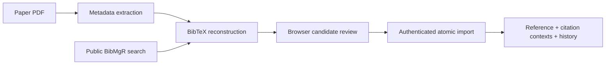

# Pipeline integration

## Data flow

Metadata extraction preserves `citation_contexts` on each extracted reference. BibTeX reconstruction can query the BibMgR public library before external services. The browser accepts reconstruction JSON, lets the user include/exclude references and select among candidates, and sends only the reviewed result through the authenticated atomic import endpoint.



## Local-library lookup

Set `api.localdb.enabled` to `true` in `pipeline/bibtex_reconstruction/config.yml` and point `api.localdb.base_url` to the paginated read endpoint. The default loopback URL is `http://127.0.0.1:8000/references/page`; production should use an HTTPS URL such as `https://bibmgr.example.edu/api/references/page`.

The client searches by title and, when available, first author and year. It chooses the best title match and accepts it only at the configured similarity threshold. This endpoint is public and never receives a session cookie or write credential. Plain HTTP is rejected unless the hostname is loopback.

## Review file

The `Pipeline result` tab accepts a JSON file up to 10 MB. It understands either a direct review format:

```json
{
  "title": "Citing paper",
  "items": [
    {
      "id": "ref-1",
      "title": "Candidate title",
      "bibtex": "@article{candidate, ...}",
      "citation_contexts": [
        {
          "before": "Earlier text.",
          "context": "Candidate title is used here.",
          "after": "Later text."
        }
      ]
    }
  ]
}
```

or reconstruction output containing `processed_references`, `original_data`, and `candidates`. String contexts and structured before/context/after objects are both accepted. The browser adds the source JSON filename and source paper title when those values are available.

## Persistence

`POST /references/pipeline-import` accepts 1–100 reviewed items. Each item must contain exactly one valid BibTeX entry and may contain up to 1,000 citation contexts. Registration uses the server-owned laboratory policy, strong DOI/arXiv uniqueness, and one database transaction for the complete request. One invalid or duplicate item rolls back all items.

The initial history snapshot includes citation contexts and `registration_source = "pipeline"`. Later contexts can be appended through `POST /references/{id}/citation-contexts`; this creates a `context` history revision without discarding BibTeX or earlier contexts. Any complete prior snapshot can be restored.
