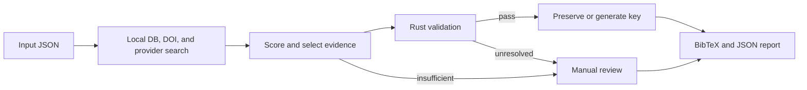

# BibTeX Reconstruction

This package reconstructs initialization-time BibTeX from `metadata_extraction` JSON. It writes validated entries and a JSON audit report, but does not register anything in BibMgR.

## Sync

From the repository root:

```bash
uv sync --project pipeline/bibtex_reconstruction --frozen
```

Linux x86_64 uses the PyTorch and vLLM CUDA 12.9 wheels pinned in `uv.lock`. A host CUDA Toolkit is not required, but the NVIDIA driver must support the pinned CUDA runtime. RTX PRO 6000 Blackwell requires an R580 or newer driver in the validated configuration.

## Configure

Public runtime settings are in [`config.toml`](./config.toml). Unknown keys are rejected at startup.

Copy `.env.sample` only when private values are required:

```bash
cp pipeline/bibtex_reconstruction/.env.sample \
  pipeline/bibtex_reconstruction/.env
```

Optional private values are `CROSSREF_MAILTO`, `CINII_APPID`, `SEMANTIC_SCHOLAR_API_KEY`, `BIBTEX_RECONSTRUCTION_LLM_API_KEY`, `BIBTEX_RECONSTRUCTION_LOCAL_LLM_API_KEY`, and `BIBTEX_RECONSTRUCTION_LOCAL_DB_COOKIE`.

ACL Anthology, J-STAGE, and arXiv require no credentials. CiNii and Semantic Scholar can be called without their optional keys, subject to provider limits.

## Serve Local vLLM

The default local model is `Qwen/Qwen3.6-27B` at `http://127.0.0.1:8001/v1`. The following limits were validated with vLLM 0.24.0+cu129.

RTX PRO 6000 Blackwell 96 GB ×1:

```bash
VLLM_USE_FLASHINFER_SAMPLER=0 \
  uv run --project pipeline/bibtex_reconstruction --frozen \
  vllm serve Qwen/Qwen3.6-27B \
  --host 127.0.0.1 \
  --port 8001 \
  --language-model-only \
  --max-model-len 8192 \
  --max-num-seqs 2 \
  --gpu-memory-utilization 0.75 \
  --generation-config vllm
```

`--max-model-len` and `--max-num-seqs` are required here because vLLM's automatically selected `max-num-seqs=1024` exceeds the available Mamba cache blocks.

RTX A6000 48 GB ×2:

```bash
uv run --project pipeline/bibtex_reconstruction --frozen \
  vllm serve Qwen/Qwen3.6-27B \
  --host 127.0.0.1 \
  --port 8001 \
  --language-model-only \
  --tensor-parallel-size 2 \
  --max-model-len 8192 \
  --max-num-seqs 4 \
  --generation-config vllm
```

The BF16 weights do not fit on one 48 GB RTX A6000, so this configuration uses tensor parallelism across two GPUs. Prefix caching is omitted because vLLM 0.24.0 reports Mamba-layer support as experimental for this model.

The health check is optional and verifies JSON-schema constrained output:

```bash
uv run --project pipeline/bibtex_reconstruction --frozen \
  bibtex-vllm-check
```

Without a local LLM, set `local_llm_enabled = false` in `config.toml`. Reconstruction still runs, but query improvement is skipped and citation-key concept generation uses deterministic fallbacks unless the optional remote fallback is enabled.

## Reconstruct

Run the CLI from a second terminal:

```bash
uv run --project pipeline/bibtex_reconstruction --frozen \
  bibtex-reconstruction extracted/paper.json \
  --output reconstructed.bib \
  --report-output reconstruction-report.json
```

Use `bibtex-reconstruction --help` for concurrency, artifact, logging, and review-related options. `--fail-on-review` returns exit status 2 when at least one reference requires manual review.

## Input

The CLI accepts both raw `ExtractionResult.to_dict()` JSON and normalized `bibmgr-paper-parse --format json` output. A normalized document has this shape:

```json
{
  "title": "Source paper",
  "authors": ["Source Author"],
  "year": "2025",
  "reference_count": 1,
  "references": [
    {
      "id": "b0",
      "title": "Cited paper",
      "authors": ["Cited Author"],
      "year": "2020",
      "doi": "10.0000/example",
      "venue": "Example Conference",
      "raw_text": "Cited Author. Cited paper. 2020."
    }
  ]
}
```

`reference_count` must equal the number of references, reference IDs must be unique, and every reference must contain non-empty `raw_text`.

## Reconstruction Policy



- Local DB entries take priority, and input DOI evidence is considered before external provider candidates.
- ACL Anthology, Crossref, Semantic Scholar, CiNii, J-STAGE, and arXiv are searched in parallel. Candidates remain independent, and normalized title and author values are used only for comparison.
- Eligible non-DOI candidates are selected in the order above. Missing fields may be added from one same-DOI source without overwriting existing values; conflicting or insufficient evidence requires manual review.
- Acceptance thresholds are defined in [`config.toml`](./config.toml). LLM output is limited to search-query improvement and citation-key concept generation; it never supplies BibTeX fields or selects a candidate.

## Citation Key

Generated keys use:

```text
{surname}-{year}-{venue}-{concept}
```

Surname, year, and venue are deterministic. The concept is selected from the title by rules, or generated by the LLM from the title, raw citation, and its pretrained knowledge when rules are insufficient. Deterministic fallbacks handle unavailable LLM output and key collisions, while Local DB entries keep their stored keys.

## Output

| Path | Content |
|---|---|
| `reconstructed.bib` | Entries accepted by per-entry Rust validation |
| `reconstruction-report.json` | Candidates, evidence, selection, validation, key generation, and review reasons |
| `reconstruction-report-artifacts/` | Input, provider payloads, and BibTeX evidence stored by SHA-256 |

The artifact directory defaults to `<report-stem>-artifacts` and can be changed with `--artifact-directory`.

## Tests

```bash
uv run --project pipeline/bibtex_reconstruction --frozen \
  pytest -q pipeline/bibtex_reconstruction/tests
```
