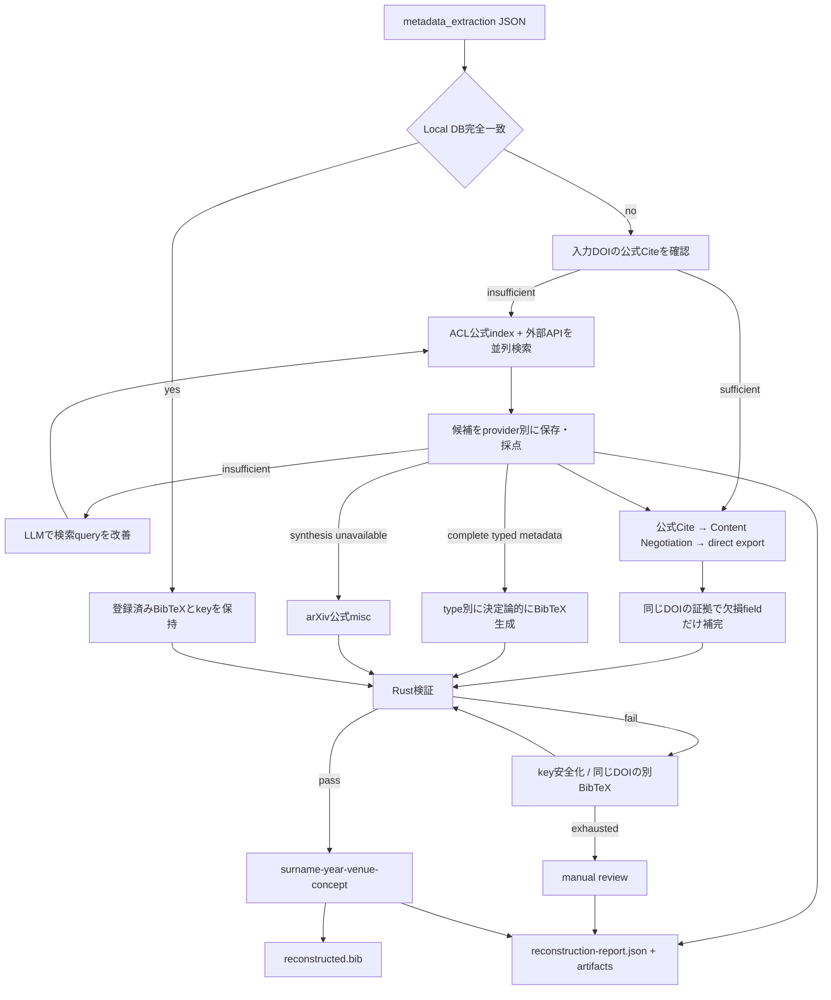

# BibTeX reconstruction

`metadata_extraction`のJSONから初期登録用BibTeXを復元するCLIです．`ExtractionResult.to_dict()`の生JSONと，`bibmgr-paper-parse --format json`の正規化JSONを入力できます．検索候補と出典を保持し，最終候補だけをRustで検証します．データベースへの登録は行いません．

## Architecture



## 判断規則

- ACL Anthology，Crossref，Semantic Scholar，CiNII，J-STAGE，arXivを並列検索し，各候補・`not_found`・`api_error`を統合せずreportへ保存します．ACLは公式BibTeX indexをlocal cacheします．
- CiNIIは複数候補の詳細を取得し，日本語・英語のtitleとauthorを別名として保持したまま再採点します．
- 照合用copyだけを正規化し，title 70%，author 30%のscoreを計算します．原metadataとBibTeXは変更しません．
- trusted DOIにはscore `0.80`以上，direct exportとmetadata生成にはscore `0.90`以上と強いauthor一致を要求します．
- 入力DOIの公式CiteとContent NegotiationをAPI検索より先に試します．APIは並列検索し，scoreで適格性を判定した後，同等の候補をACL Anthology，Crossref，Semantic Scholar，CiNII，J-STAGE，arXivの順に扱います．信頼できるDOIが見つかればその公式BibTeXを優先し，取得できない場合だけ適格なdirect exportを使います．
- 補完は同じDOIを持つ1ソースから欠損fieldにだけ行い，既存値は上書きしません．不一致は`manual_review`に送ります．
- APIのBibTeXを直接取得できない場合は，単一候補のpublication typeが一意で，type別必須fieldが揃うときだけ`article`，`inproceedings`，`book`，`incollection`を生成します．各fieldの出典と年の差はreportに残します．
- 生成条件を満たす正式版候補がない場合は，title・authorが強く一致したarXiv公式`misc`をyearの差で棄却せず，改変せず採用します．明示的なarXiv IDはtitle検索を経由せず直接解決します．
- Rust検証に失敗した場合はfieldを変えずにkeyを安全化し，同じDOIのContent Negotiationとdirect exportへfallbackします．
- LLMに許可するのは検索query改善とcitation keyのconcept生成だけです．BibTeX生成，field補完，候補採用には使用しません．

## Citation key

```text
{surname}-{year}-{venue}-{concept}
```

`surname`，`year`，`venue`はルールで生成します．`concept`は次の順で決定します．

1. title中の固有名・acronymをルールで抽出
2. 抽出できない場合だけLLMが代表的な手法・モデル・dataset名を選択
3. LLMを利用できない場合はtitle由来の技術語へfallback

`concept`は小文字ASCII英数字の1語です．衝突時は別候補を試し，最後にstable hashを付けます．Local DB完全一致では既存keyを保持します．

## Setup

Python 3.12と`uv`を使用します．個別の`pip install`は不要です．

```bash
uv sync --project pipeline/bibtex_reconstruction --frozen
```

公開可能な設定は[config.toml](./config.toml)，credentialは`.env`で管理します．local vLLMと認証不要APIだけなら`.env`は不要です．

```bash
cp pipeline/bibtex_reconstruction/.env.sample \
  pipeline/bibtex_reconstruction/.env
```

credentialは`CROSSREF_MAILTO`，`CINII_APPID`，`SEMANTIC_SCHOLAR_API_KEY`です．J-STAGEとarXivに登録は必要ありません．

Linux x86_64ではPyTorchとvLLMのCUDA 12.9版を`uv.lock`に固定しています．ホストのCUDA Toolkitは不要ですが，BlackwellではR580以降のNVIDIA driverが必要です．

## Run

repository rootから2つのterminalを使います．最初のterminalでlocal vLLMを起動します．

```bash
VLLM_USE_FLASHINFER_SAMPLER=0 \
  uv run --project pipeline/bibtex_reconstruction --frozen \
  vllm serve Qwen/Qwen3.6-27B \
  --host 127.0.0.1 \
  --port 8001 \
  --language-model-only
```

別のterminalでCLIを実行します．`bibtex-vllm-check`はstructured outputを確認する任意の事前検査です．

```bash
uv run --project pipeline/bibtex_reconstruction --frozen \
  bibtex-vllm-check

uv run --project pipeline/bibtex_reconstruction --frozen \
  bibtex-reconstruction \
  pipeline/bibtex_reconstruction/data/input.json \
  --output pipeline/bibtex_reconstruction/data/reconstructed.bib \
  --report-output pipeline/bibtex_reconstruction/data/reconstruction-report.json
```

処理後はvLLM側のterminalで`Ctrl-C`を押してserverを停止します．

## Output

| path | 内容 |
|---|---|
| `reconstructed.bib` | Rust検証を通過したentry |
| `reconstruction-report.json` | 候補，採否，検証，key生成，review理由 |
| `reconstruction-report-artifacts/` | 原入力，API応答，BibTeXをSHA-256で保存した証拠 |

## Test

```bash
uv run --project pipeline/bibtex_reconstruction --frozen \
  pytest -q pipeline/bibtex_reconstruction/tests
```
