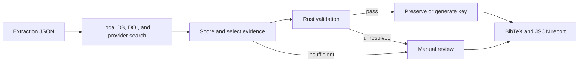

# BibTeX Reconstruction

This stage reconstructs evidence-grounded BibTeX from one metadata-extraction JSON document. It writes validated entries, a structured audit report, and content-addressed evidence artifacts; it never registers records in BibMgR. See the [initialization pipeline overview](../README.md) for the boundary between extraction and reconstruction. All commands below run from the repository root.

## Setup

Install the locked runtime and development dependencies:

```bash
uv sync --project pipeline/bibtex_reconstruction --frozen
```

The package requires Python 3.12. Linux x86_64 uses the PyTorch and vLLM CUDA 12.9 wheels pinned in `uv.lock`. A host CUDA Toolkit is not required, but the NVIDIA driver must support the pinned CUDA runtime. RTX PRO 6000 Blackwell requires an R580 or newer driver in the validated configuration.

When the optional remote LLM fallback is enabled, include its extra during synchronization and execution:

```bash
uv sync --project pipeline/bibtex_reconstruction --frozen \
  --extra remote-llm
```

## Configuration

Public, non-secret runtime settings are in [`config.toml`](./config.toml), including selection thresholds, provider timeouts, concurrency, local-LLM behavior, and optional local-library lookup. Unknown keys are rejected at startup.

Copy `.env.sample` only when private values are required:

```bash
cp pipeline/bibtex_reconstruction/.env.sample \
  pipeline/bibtex_reconstruction/.env
```

Optional private values are `CROSSREF_MAILTO`, `CINII_APPID`, `SEMANTIC_SCHOLAR_API_KEY`, `BIBTEX_RECONSTRUCTION_LLM_API_KEY`, `BIBTEX_RECONSTRUCTION_LOCAL_LLM_API_KEY`, and `BIBTEX_RECONSTRUCTION_LOCAL_DB_COOKIE`. ACL Anthology, J-STAGE, and arXiv require no credentials. CiNii and Semantic Scholar can be called without their optional keys, subject to provider limits.

Without a local LLM, set `local_llm_enabled = false` in `config.toml`. Reconstruction still runs, but query improvement is skipped and citation-key concept generation uses deterministic fallbacks unless the optional remote fallback is enabled. When enabling `remote_llm_fallback_enabled`, also pass `--extra remote-llm` to `uv run` so the provider dependency remains in the environment.

### Local vLLM Service

The default local model is `Qwen/Qwen3.6-27B` at `http://127.0.0.1:8001/v1`. The following limits were validated with vLLM 0.24.0+cu129.

RTX PRO 6000 Blackwell 96 GB ×1:

```bash
VLLM_USE_FLASHINFER_SAMPLER=0 \
  uv run --project pipeline/bibtex_reconstruction --frozen \
  vllm serve Qwen/Qwen3.6-27B \
  --host 127.0.0.1 \
  --port 8001 \
  --language-model-only \
  --max-model-len 8192 \
  --max-num-seqs 2 \
  --gpu-memory-utilization 0.75 \
  --generation-config vllm
```

`--max-model-len` and `--max-num-seqs` are required here because vLLM's automatically selected `max-num-seqs=1024` exceeds the available Mamba cache blocks.

RTX A6000 48 GB ×2:

```bash
uv run --project pipeline/bibtex_reconstruction --frozen \
  vllm serve Qwen/Qwen3.6-27B \
  --host 127.0.0.1 \
  --port 8001 \
  --language-model-only \
  --tensor-parallel-size 2 \
  --max-model-len 8192 \
  --max-num-seqs 4 \
  --generation-config vllm
```

The BF16 weights do not fit on one 48 GB RTX A6000, so this configuration uses tensor parallelism across two GPUs. Prefix caching is omitted because vLLM 0.24.0 reports Mamba-layer support as experimental for this model.

Verify the configured service and its JSON-schema constrained output before a long run:

```bash
uv run --project pipeline/bibtex_reconstruction --frozen \
  bibtex-vllm-check
```

## Usage

Reconstruct one extraction document:

```bash
uv run --project pipeline/bibtex_reconstruction --frozen \
  bibtex-reconstruction extracted/paper.json \
  --output reconstructed.bib \
  --report-output reconstruction-report.json
```

Use `--artifact-directory` to change the evidence directory, `--log-file` for detailed logs, and `--fail-on-review` to return status 2 when any reference requires manual review.

## Input Contract

The CLI accepts one raw `ExtractionResult.to_dict()` JSON object or one normalized `bibmgr-paper-parse --format json` document. It does not accept the batch array emitted by a multi-PDF extraction run; use the per-PDF normalized files below the extraction `--save-dir`.

A normalized document has this shape:

```json
{
  "title": "Source paper",
  "authors": ["Source Author"],
  "year": "2025",
  "reference_count": 1,
  "references": [
    {
      "id": "b0",
      "title": "Cited paper",
      "authors": ["Cited Author"],
      "year": "2020",
      "doi": "10.0000/example",
      "venue": "Example Conference",
      "raw_text": "Cited Author. Cited paper. 2020."
    }
  ]
}
```

`reference_count` must equal the number of references, reference IDs must be unique, and every reference must contain non-empty `raw_text`.

## Output Contract

| Default path | Content |
| --- | --- |
| `reconstructed.bib` | Entries accepted by per-entry Rust validation |
| `reconstruction-report.json` | Outcomes, candidates, evidence, selection, validation, key generation, and review reasons |
| `reconstruction-report-artifacts/` | Input, provider payloads, and BibTeX evidence stored by SHA-256 |

The artifact directory defaults to `<report-stem>-artifacts` and can be changed with `--artifact-directory`. Ready entries are written in input-reference order. References that cannot be resolved safely remain in the report with a manual-review outcome rather than being emitted as speculative BibTeX.

The normal success status is 0. `--fail-on-review` changes the status to 2 when the completed report contains at least one manual-review outcome; the BibTeX, report, and evidence artifacts are still written.

## Concurrency and Resource Limits

`--threads` controls concurrent reference workers and defaults to `reference_threads = 2` from `config.toml`. `--api-threads` controls concurrent provider searches inside each reference worker and defaults to `api_threads = 3`.

The two concurrency layers multiply potential in-flight provider work. Reduce either value when provider rate limits, local model throughput, file descriptors, or memory are constrained. Provider-specific waits, timeouts, response-size ceilings, retry counts, and cache limits are defined in `config.toml` and enforced independently of the thread counts.

## Processing Policy



- Local DB entries take priority, and input DOI evidence is considered before external provider candidates.
- ACL Anthology, Crossref, Semantic Scholar, CiNii, J-STAGE, and arXiv are searched in parallel. Candidates remain independent, and normalized title and author values are used only for comparison.
- Eligible non-DOI candidates are selected in the order above. Missing fields may be added from one same-DOI source without overwriting existing values; conflicting or insufficient evidence requires manual review.
- Acceptance thresholds are defined in [`config.toml`](./config.toml). LLM output is limited to search-query improvement and citation-key concept generation; it never supplies BibTeX fields or selects a candidate.
- This stage does not modify the extraction document or write to the BibMgR database.

Generated citation keys use `{surname}-{year}-{venue}-{concept}`. Surname, year, and venue are deterministic. The concept comes from title rules or, when rules are insufficient, an LLM constrained to key-concept generation. Deterministic fallbacks handle unavailable LLM output and key collisions, while Local DB entries retain their stored keys.

## Programmatic API

`reconstruct_file(input_path, output_path, report_path, ...)` reconstructs one extraction document and returns the emitted BibTeX entries plus the typed `ReconstructionReport`. Callers may provide an orchestrator, key generator, artifact directory, and explicit reference/API thread counts; file outputs and manual-review semantics match the CLI.

## Testing

```bash
uv run --project pipeline/bibtex_reconstruction --frozen \
  pytest -q pipeline/bibtex_reconstruction/tests
```
