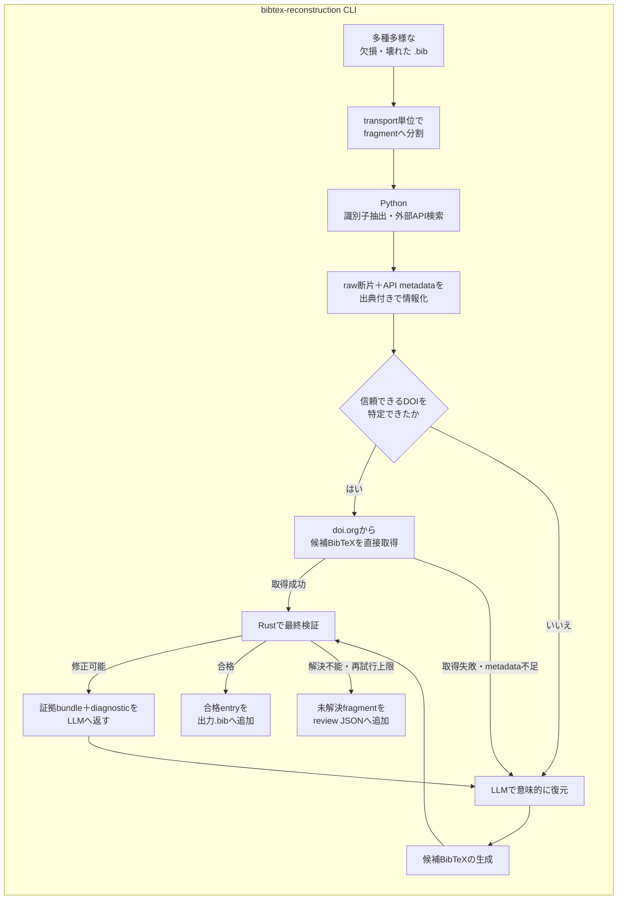

# BibTeX reconstruction

`bibtex_reconstruction`は、欠損・破損した`.bib`を外部APIとLLMで復元し、PR #19で導入されたRust実装で最終検証して、登録候補となるBibTeX entryの集合を作る初期化専用CLIです。

一般利用のアプリ、backend、frontendとは独立しています。このCLIはデータベースへ登録せず、Rust検証に合格した`.bib`と、解決できなかったfragmentの手動確認用JSONを生成します。

## Architecture



fragment分割はtransport処理であり、登録可否を判断するparserではありません。`@article`などのblock開始位置で分割するため、閉じ括弧が欠けたentryも次のblockと分離でき、`@string`、`@preamble`、`@comment`は各fragmentのcontextとして保持されます。

検索手掛かりは既存の`bibtexparser`とname parserを利用して保守的に抽出します。抽出に失敗しても入力を拒否せず、raw fragmentを証拠として後続処理へ渡します。

元入力に正確なDOIが含まれる場合は曖昧検索とLLMを省略し、doi.orgのContent Negotiationから取得したBibTeXをRustへ直接送ります。

検索結果からDOIを採用する場合は、タイトル類似度が`trusted_doi_threshold`以上であり、既知の発行年と矛盾せず、入力と候補の著者トークンが少なくとも一つ一致することを要求します。

DOI候補とLLM候補には、既存`bibtexparser`のmonth middlewareとRustのsafe fixを先に適用します。初期化後のcitation keyを新規に採番できる場合は、`rewrite_citation_keys`によりRustが提示したkey fixも適用します。

これらの決定的な修正でも解決できない場合だけ、raw fragmentと全API候補を出典付きの証拠bundleとしてLLMへ渡します。LLMの出力は毎回`bibmgr_native.validate_for_registration()`で検証し、Rust diagnosticを使った修正が`max_llm_attempts`回で合格しなければ手動確認用JSONへ送ります。

## Independence from the application

一般利用時の検索、登録、exportはこのdirectoryをimportしません。通常登録で不正なBibTeXを拒否する責務は、アプリが利用する`bibmgr-*`のRust実装にあります。

初期化CLI内では`ready`と`manual_review`を処理結果として使いますが、これは初期化成果物の振り分け専用です。一般アプリのrecordやAPI schemaへ`needs_review` flagを追加するものではありません。

## Directory responsibilities

- `main.py`: `.bib`入力、並列処理、合格entry集合の保存、review JSONの保存を行うCLIです。

- `services/source_loader.py`: 壊れたfileを登録判定せずfragmentへ分割します。

- `services/orchestrator.py`: DOI直通、並列検索、証拠bundle、LLM再試行、Rust検証を制御します。

- `services/semantic_reconstructor.py`: 証拠に基づくGemini structured outputと修正promptを管理します。

- `api_clients/`: Crossref、Semantic Scholar、CiNii、J-STAGE、arXiv、doi.orgなどからmetadataまたはBibTeXを取得します。

- `core/source_clues.py`: `bibtexparser`とname parserでtitle、author、year、DOI、venueの検索手掛かりを抽出します。

- `core/native_validation.py`: Python側で検証規則を再実装せず、PR #19のRust登録判定を呼び出します。

- `models/`: API候補、証拠bundle、LLM結果、Rust diagnostic、各試行の監査情報を定義します。

## Setup

必要なPythonは3.12です。リポジトリルートからCLIの依存関係とRust extensionを同期します。

```bash
uv sync --project pipeline/bibtex_reconstruction --group dev
```

環境変数の雛形をコピーし、必要な値を設定します。

```bash
cp pipeline/bibtex_reconstruction/.env.sample pipeline/bibtex_reconstruction/.env
```

主な環境変数は次のとおりです。

- `GEMINI_API_KEY`: DOI経路で解決できない文献を意味的に復元するために必要です。

- `CROSSREF_MAILTO`: Crossrefのpolite poolを利用する連絡先です。

- `CINII_APPID`: CiNii APIのアプリケーションIDです。

- `SEMANTIC_SCHOLAR_API_KEY`: Semantic Scholar APIの認証に使用します。

`GEMINI_API_KEY`が未設定でもDOI直通経路は利用できますが、LLMが必要なfragmentは推測で補完せず`manual_review`へ送られます。

## Run

```bash
uv run --project pipeline/bibtex_reconstruction \
  python pipeline/bibtex_reconstruction/main.py damaged.bib \
  --output reconstructed.bib \
  --review-output reconstruction-review.json
```

`--fail-on-review`を指定すると、手動確認対象が一件以上ある場合に終了status `2`を返します。CIや初期化scriptから完全自動処理できたかを判定する場合に利用できます。

## Outputs

`reconstructed.bib`にはRustの登録判定に合格したentryだけが入力順で格納されます。LLMが生成しただけの未検証entryは含まれません。

```bibtex
@article{example,
  author = {Doe, Jane},
  title = {An Example},
  journal = {Journal of Examples},
  year = {2025},
  doi = {10.1000/example}
}
```

`reconstruction-review.json`には件数、未解決fragment、検索証拠、候補、LLM試行、Rust diagnostic、手動確認理由が保存されます。生成されたBibTeX entry自体をGitへ追加する必要はありません。

```json
{
  "schema_version": "1",
  "total_fragments": 10,
  "reconstructed_count": 8,
  "manual_review_count": 2,
  "manual_review": []
}
```

## Configuration

`config.yml`で次の動作を調整できます。

- `search.similarity_threshold`: 外部API候補を高類似候補とみなす閾値です。

- `search.trusted_doi_threshold`: 検索で発見したDOIをLLM省略経路へ送るための厳しいタイトル類似度です。

- `llm.model_name`: 意味的復元に利用するGemini modelです。

- `llm.max_llm_attempts`: Rust diagnosticを使ったLLM修正の最大回数です。

- `validation.registration_policy`: `bibmgr_native.validate_for_registration()`へ渡すpolicyです。

- `validation.rewrite_citation_keys`: 初期化成果物のcitation keyをRustのpolicyに合わせて再採番してよいかを指定します。

- `api.*`: 各外部APIのendpoint、timeout、retry設定です。

venueの省略名やexport形式はこのCLIでハードコードしません。登録後の出力はRustのexport profileと`config/registries/venues.toml`が担当します。

## Test

```bash
uv run --project pipeline/bibtex_reconstruction \
  pytest pipeline/bibtex_reconstruction/tests -q
```

テストでは、壊れたfileのfragment分割、既存parserによる検索手掛かり抽出、DOI直通によるLLM省略、検索DOIの整合確認、Rust diagnosticを使ったLLM再試行、手動確認への分離、実際の`bibmgr_native`による合格・拒否を検証します。
