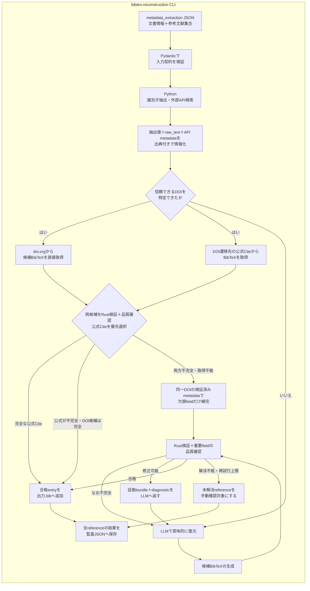

# BibTeX reconstruction

`bibtex_reconstruction`は，`metadata_extraction`が出力した文書・参考文献JSONから，外部APIとLLMで`.bib`を復元し，Rust実装で最終検証することで，登録候補となるBibTeX entryの集合を作る初期化専用CLIです．

一般利用のアプリ，backend，frontendとは独立しています．
このCLIはデータベースへ登録せず，Rust検証に合格した`.bib`と，全参考文献の処理経路・証拠・診断を含む監査用JSONを生成します．

## Architecture



入力JSONのrootには元文書の`title`，`authors`，`year`，`doi`，`abstract`と，`reference_count`，`references`を持たせます．各referenceには一意な`id`，抽出済みの`title`，`authors`，`year`，`doi`，`venue`と，元の引用文字列である`raw_text`を渡します．`reference_count`と配列長の不一致，重複ID，未定義fieldは入力契約のずれとして処理開始前に拒否します．

抽出済みfieldは確定値ではなく検索手掛かりとして扱います．`venue`には誌名だけでなく巻・号・pageなどが含まれる可能性があるため，正規化済みvenueとはみなしません．`raw_text`は抽出結果を検証・補完するための一次情報として常に証拠bundleへ残します．`2017a`，`2017b`のような年は元の値を保存しつつ，外部metadataとの照合時には`2017`として比較します．

元入力または検索から信頼できるDOIを特定した場合は，doi.orgのContent Negotiationと，DOIの通常の遷移先が公開する公式Cite/BibTeXの両方へ必ずアクセスします．片方が完全でも他方の取得を省略しません．両候補をRustの登録判定に加えて，`title`，`author`または`editor`，`year`とentry type固有の掲載先fieldが存在するか確認します．

採用優先順位は，完全な公式Cite/BibTeX，完全なDOI Content Negotiation，補完可能な公式Cite/BibTeX，補完可能なDOI Content Negotiationの順です．公式Cite探索は特定サイト名には依存せず，`application/x-bibtex`のalternate，`.bib`またはBibTeX download link，ページ内の`pre`，`code`，`textarea`，`citation_bibtex` metadataを`lxml`で探索します．JavaScript操作，認証，POSTが必要なCite機能やBibTeXを公開していないサイトは無理に解析せず，次の候補へ進みます．

公式Citeでも解決しない場合に限り，同じDOIを持ち高類似と判定された外部API候補から，既存値を上書きせず欠損fieldだけを補完します．補完後も同じRust検証と品質確認を行い，不完全なら証拠bundleと直前候補をLLMへ渡します．

検索結果からDOIを採用する場合は，タイトル類似度が`trusted_doi_threshold`以上であり，既知の発行年と矛盾せず，入力と候補の著者トークンが少なくとも一つ一致することを要求します．

外部検索はreference単位では並列実行しますが，同一providerへのHTTP requestはprovider共通のrate limiterで直列化します．providerごとの`wait_sec`をrequest開始間隔として適用し，429の`Retry-After`またはbackoff時間は待機中の全threadで共有します．

DOI候補，公式Cite候補，LLM候補は，`modern` policyの`bibmgr_native.validate_for_registration()`へ渡します．完全な候補は再serializeせず，sourceのfield，大小文字，順序，delimiter，未知fieldを保持します．不完全な候補へ検証済みmetadataを補う場合だけBibTeX CSTを再serializeし，既存fieldを上書きせず欠損fieldを追加します．safe fixやcitation key変更は行いません．

Rust検証で解決できない場合は，抽出済みfield，`raw_text`，全API候補とdiagnosticを出典付きの証拠bundleとしてLLMへ戻します．LLMによる明示的な再生成が`max_llm_attempts`回で合格しなければ手動確認対象にします．研究室ルールへの準拠やfieldの選択・順序・表記はこのpipelineの登録判定では扱わず，登録後の`laboratory` export profileによる検証・整形へ委ねます．

## Independence from the application

一般利用時の検索，登録，exportはこのdirectoryをimportしません．
通常登録で不正なBibTeXを拒否する責務は，アプリが利用する`bibmgr-*`のRust実装にあります．

初期化CLI内では`ready`と`manual_review`を処理結果として使いますが，これは初期化成果物の振り分け専用です．
一般アプリのrecordやAPI schemaへ`needs_review` flagを追加するものではありません．

## Directory responsibilities

実装は標準的なsrc layoutで`src/bibtex_reconstruction`へ集約しています．`tests`はpackage外から公開interfaceを利用する形で独立させています．

```text
bibtex_reconstruction/
├── src/bibtex_reconstruction/
│   ├── application/
│   ├── clients/
│   │   └── llm/
│   ├── domain/
│   ├── parsing/
│   ├── validation/
│   ├── cli.py
│   ├── config.py
│   └── matching.py
└── tests/
```

- `cli.py`: `metadata_extraction` JSONの入力，referenceの並列処理，合格entry集合と監査JSONの保存を行います．
- `application/`: source読込，DOI直通，並列検索，証拠bundle，LLM再試行，Rust検証というuse case全体を制御します．
- `clients/`: Crossref，Semantic Scholar，CiNii，J-STAGE，arXiv，doi.org，DOI遷移先の公式CiteおよびLLM providerとの外部通信を担当します．
- `domain/`: `metadata_extraction`との公開入出力契約，処理状態，API候補，証拠bundle，LLM結果，Rust diagnostic，監査情報を定義します．
- `parsing/`: DOIなどの識別子抽出，XML処理，BibTeXの重要field品質確認・欠損補完，検索手掛かりの補完を担当します．
- `validation/`: Python側で規則や整形を再実装せず，Rustのsource-preservingな`modern`登録判定を呼び出します．
- `config.py`: 環境変数を含むruntime設定を一か所で管理します．
- `matching.py`: 外部metadata候補の類似度計算を提供します．

## Setup

必要なPythonは3.12です．リポジトリルートからCLIの依存関係とRust extensionを同期します．

```bash
uv sync --project pipeline/bibtex_reconstruction --group dev
```

環境変数の雛形をコピーし，必要な値を設定します．

```bash
cp pipeline/bibtex_reconstruction/.env.sample pipeline/bibtex_reconstruction/.env
```

主な環境変数は次のとおりです．

- `BIBTEX_RECONSTRUCTION_LLM_PROVIDER`: 意味的復元に利用するproviderです．`gemini`，`openai`，`openai_compatible`から選択します．
- `BIBTEX_RECONSTRUCTION_LLM_MODEL`: providerへ渡すmodel名です．
- `BIBTEX_RECONSTRUCTION_LLM_API_KEY`: providerのAPI keyです．認証不要のlocal OpenAI互換serverでは空にできます．
- `BIBTEX_RECONSTRUCTION_LLM_BASE_URL`: OpenAI互換APIのbase URLです．`openai`では未指定時に公式endpointを使用します．
- `CROSSREF_MAILTO`: Crossrefのpolite poolを利用する連絡先．詳しくは[こちら](https://api.crossref.org/swagger-ui/index.html)
- `CINII_APPID`: CiNii APIのアプリケーションID．登録は[こちら](https://api.ci.nii.ac.jp/ja/)
- `SEMANTIC_SCHOLAR_API_KEY`: Semantic Scholar APIの認証に使用．登録は[こちら](https://www.semanticscholar.org/product/api#api-key-form)

選択したproviderの必須設定が不足していてもDOI・公式Cite経路は利用できますが，LLMが必要なreferenceは推測で補完せず`manual_review`へ送られます．

## Run

入力JSONを`pipeline/bibtex_reconstruction/data/input.json`へ配置して実行scriptを起動します．scriptは自身の位置からGit repository rootを特定して移動するため，呼び出し元のworking directoryには依存しません．

```bash
pipeline/bibtex_reconstruction/run.sh
```

`data/reconstructed.bib`と`data/reconstruction-report.json`が生成されます．
`data/`は入力・生成物を含めてGitの追跡対象外です．scriptへ渡した追加引数はCLIへそのまま渡されるため，完全自動処理の成否を終了statusで確認する場合は次のように実行できます．

```bash
pipeline/bibtex_reconstruction/run.sh --fail-on-review
```

referenceと各reference内のprovider検索は，それぞれthread数を指定できます．

```bash
pipeline/bibtex_reconstruction/run.sh \
  --threads 2 \
  --api-threads 3
```

`--threads`は同時に復元するreference数，`--api-threads`は一つのreferenceについて同時に検索するprovider数です．既定値はそれぞれ`2`と`3`です．同一providerへの実際のHTTP requestは，これらのthread数にかかわらずprovider単位で直列化されます．

### Execution logs

端末には処理開始，各API検索の開始・終了・status・score，各referenceの進捗・結果，完了件数を`INFO` levelで表示します．複数referenceを並列処理しても，`progress=3/28 ref_id=b2 outcome=ready`のように全体の進捗を確認できます．

詳細ログは実行ごとに次の場所へ保存されます．

```text
pipeline/bibtex_reconstruction/data/logs/reconstruction-YYYYMMDD-HHMMSS-PID.log
```

`data/logs/latest.log`は常に直近の実行ログを指します．別のterminalから追跡する場合は次のように確認できます．

```bash
tail -f pipeline/bibtex_reconstruction/data/logs/latest.log
```

詳細ログには`DEBUG`以上の情報を保存し，reference IDと処理threadを含む全経路を後から確認できます．API検索の開始・終了・status・scoreは初期化結果の根拠なので`INFO`とし，parser内部の回復可能な失敗など，通常の処理確認には不要な情報だけを`DEBUG`とします．

HTTP失敗時はAPI key，URL query，response bodyを記録せず，処理段階，HTTP status，retry可否だけを保存します．端末にも詳細を表示したい場合は次のように実行します．

```bash
pipeline/bibtex_reconstruction/run.sh --log-level DEBUG
```

CLIを直接起動する場合は次のコマンドと同等です．

```bash
uv run --project pipeline/bibtex_reconstruction \
  bibtex-reconstruction \
  pipeline/bibtex_reconstruction/data/input.json \
  --output pipeline/bibtex_reconstruction/data/reconstructed.bib \
  --report-output pipeline/bibtex_reconstruction/data/reconstruction-report.json \
  --log-file pipeline/bibtex_reconstruction/data/logs/reconstruction.log
```

同じCLIは`python -m bibtex_reconstruction`でも起動できます．

`--fail-on-review`を指定すると，手動確認対象が一件以上ある場合に終了status `2`を返します．CIや初期化scriptから完全自動処理できたかを判定する場合に利用できます．
従来の`--review-output`も`--report-output`のaliasとして利用できます．

## Outputs

`reconstructed.bib`にはRustの`modern`登録判定と重要fieldの品質確認に合格したentryだけが入力順で格納されます．完全な候補はDOI provider，公式CiteまたはLLMが生成した表現を保持し，metadata補完時だけ欠損fieldを追加します．LLMが生成しただけの未検証entryは含まれません．研究室形式が必要な場合は，登録後に`laboratory` profileでexportします．

```bibtex
@article{example,
  author = {Doe, Jane},
  title = {An Example},
  journal = {Journal of Examples},
  year = {2025},
  doi = {10.1000/example}
}
```

`reconstruction-report.json`には元文書metadataと，全referenceの結果，検索証拠，候補，DOI・公式Cite・metadata補完・LLMの各試行，Rust diagnostic，重要fieldの`quality_issues`，公式Citeの`source_url`，`filled_fields`，必要な場合は手動確認理由が保存されます．`processed_references`に成功・失敗の両方を残すため，入力IDから各entryの処理経路を追跡できます．検索結果が存在しない場合は`not_found`，通信・認証・provider応答の異常は`api_error`として区別し，後者には秘密情報を含まないerror summaryを保存します．生成されたBibTeX entry自体をGitへ追加する必要はありません．

```json
{
  "schema_version": "1",
  "input_path": "metadata.json",
  "bibtex_output_path": "reconstructed.bib",
  "document": {
    "title": "Source document",
    "authors": ["Author One"]
  },
  "total_reference_count": 1,
  "reconstructed_count": 1,
  "manual_review_count": 0,
  "processed_references": [
    {
      "ref_id": "b0",
      "outcome": "ready"
    }
  ]
}
```

## Configuration

設定の既定値と型は`src/bibtex_reconstruction/config.py`の`Settings`へ集約しています．
秘密情報や実行環境ごとの差分だけを`.env`で指定し，リポジトリ内の設定YAMLは使用しません．

主な調整項目は次のとおりです．

- `BIBTEX_RECONSTRUCTION_SIMILARITY_THRESHOLD`: 外部API候補を高類似候補とみなす閾値です．
- `BIBTEX_RECONSTRUCTION_TRUSTED_DOI_THRESHOLD`: 検索で発見したDOIをLLM省略経路へ送るためのタイトル類似度です．
- `BIBTEX_RECONSTRUCTION_REFERENCE_THREADS`: 同時に復元するreference数です．既定値は`2`です．
- `BIBTEX_RECONSTRUCTION_API_THREADS`: 一つのreferenceについて同時に検索するprovider数です．既定値は`3`です．
- `BIBTEX_RECONSTRUCTION_LLM_MAX_ATTEMPTS`: Rust diagnosticを使ったLLM修正の最大回数です．
- `BIBTEX_RECONSTRUCTION_CITATION_SITE_MAX_BYTES`: 公式Cite探索で受け取る一responseの最大byte数です．
- `BIBTEX_RECONSTRUCTION_CITATION_SITE_MAX_LINKS`: 一つの公式ページから試すBibTeX候補linkの上限です．
- `BIBTEX_RECONSTRUCTION_<PROVIDER>_WAIT_SEC`: providerごとのHTTP request開始間隔です．`CROSSREF`，`CINII`，`SEMANTICSCHOLAR`，`JSTAGE`，`ARXIV`，`DOI`，`CITATION_SITE`を指定できます．
API endpointやtimeoutも`BIBTEX_RECONSTRUCTION_`に`Settings`のfield名を大文字で続けることで上書きできますが，通常は変更不要です．

WAIT_SECの既定値は，実行ログとproviderの利用方針から次のように設定しています．

| provider | WAIT_SEC | 根拠 |
|---|---:|---|
| DOI | `0.1` | 旧ログではrate limitがなく，同時接続の直列化を主対策とするため |
| Official citation site | `0.5` | DOI遷移先とBibTeX exportへの連続requestを抑制するため |
| Crossref | `1.0` | title検索はlist queryであり，public poolの上限1 request/秒に合わせるため |
| CiNii | `1.0` | 数値上限は公開されていないが，短時間の大量accessが禁止されているため |
| Semantic Scholar | `1.0` | API keyの初期上限が1 request/秒であるため |
| J-STAGE | `0.5` | 旧ログのHTTP errorが1回だけで，軽い抑制で十分と判断したため |
| arXiv | `3.0` | legacy APIは3秒に1 requestかつ同時接続1と指定されているため |

venueの省略名やexport形式はこのCLIでハードコードしません．登録後の出力はRustのexport profileと`config/registries/venues.toml`が担当します．

## Test

```bash
uv run --project pipeline/bibtex_reconstruction \
  pytest pipeline/bibtex_reconstruction/tests -q
```

テストでは，`metadata_extraction`出力に対する入力契約，件数・IDの整合性，検索手掛かりの補完，DOIの両取得経路が常に実行されること，公式Citeの優先，不完全候補の品質検出，汎用的な公式Cite探索，既存値を上書きしないmetadata補完，検索DOIの整合確認，Rust検証，diagnosticを使ったLLM再試行，手動確認への分離，全referenceを含む監査reportを検証します．
