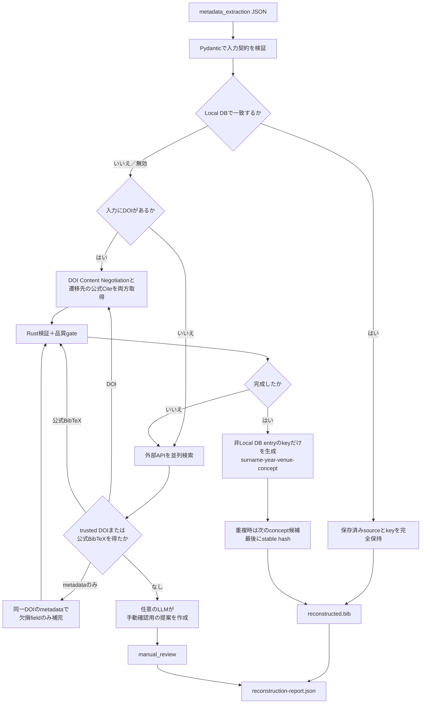

# BibTeX reconstruction

`bibtex_reconstruction`は，`metadata_extraction`が出力した文書・参考文献JSONから，信頼できる外部情報を使ってBibTeX entryの集合を復元する初期化専用CLIです．一般利用のbackendとfrontendからは独立しており，データベースへの登録は行いません．

成果物は，Rust検証を通過した`reconstructed.bib`と，全referenceの根拠，処理経路，診断，citation key生成結果を記録した`reconstruction-report.json`です．LLMの出力を文献情報として自動採用することはありません．

## Architecture



Local DB，外部情報，LLMは同じ信頼度として扱いません．採用順と責務は次のとおりです．

1. Local DBで一致したentryは，すでにBibMgRの登録検証を通過した情報として最優先します．外部API，DOI，LLMを呼ばず，保存済みBibTeXとcitation keyを変更しません．
2. DOIがあれば，doi.orgのContent NegotiationとDOI遷移先の公式Cite／BibTeXを必ず両方確認します．完成度が同じなら公式Citeを優先します．
3. DOIがない，または取得結果が不完全な場合は，Crossref，Semantic Scholar，CiNii，J-STAGE，arXivを検索します．
4. Rust検証と復元品質gateを通過した信頼済みBibTeXだけを自動採用します．
5. 確定的な情報だけで完成しない場合，LLMは検索query，候補評価，未解決field，参考BibTeXを手動確認用に提案できます．この提案は`reconstructed.bib`へ入りません．
6. 全referenceの復元後，Local DB以外の採用entryについてcitation keyの範囲だけを編集します．

## Processing stages

### 1．入力契約

rootには元文書の`title`，`authors`，`year`，`doi`，`abstract`，`reference_count`，`references`を指定します．各referenceは一意な`id`と`raw_text`を必須とし，`title`，`authors`，`year`，`doi`，`venue`，`pages`，`publication_info`，`context`，`citation_contexts`を検索手掛かりとして受け取れます．

`reference_count`と配列長の不一致，重複ID，未定義fieldは処理開始前に拒否します．`2017a`のような年は元表現を保存し，照合時だけ`2017`として扱います．

### 2．Local DB

`BIBTEX_RECONSTRUCTION_LOCAL_DB_ENABLED=true`の場合，BibMgRの`GET /references/page`を最初に検索します．DOIがあれば`identifier` filterも使用し，titleが欠損していても照合できます．一致したentryは登録済みsourceをそのまま採用し，以後の復元処理とkey生成を省略します．

endpointが認証を要求する場合は，`BIBTEX_RECONSTRUCTION_LOCAL_DB_COOKIE`へCookie headerの値を設定します．平文HTTPはloopback addressにだけ許可します．

### 3．DOI復元

信頼できるDOIごとに次の二経路を実行します．

- doi.orgへ`Accept: application/x-bibtex`を送るContent Negotiation
- DOI遷移先で`application/x-bibtex`のalternate，`.bib` download，`pre`，`code`，`textarea`，`citation_bibtex` metadataを探す公式Cite探索

公式Cite探索は`lxml`を使用し，特定publisher名へ依存しません．JavaScript，login，POSTが必要なexportは対象外です．redirect先とcitation linkはscheme，port，localhost，private IP literalを検査し，response sizeと探索link数にも上限を設けます．

候補の優先順位は次のとおりです．

1. 完成した公式Cite
2. 完成したContent Negotiation
3. 補完可能な公式Cite
4. 補完可能なContent Negotiation

### 4．外部検索とmetadata補完

外部API候補は`match`，`weak_match`，`not_found`，`api_error`へ分類します．検索結果のDOIをtrusted DOIとするには，title類似度，既知年との整合，著者tokenの一致を満たす必要があります．

不完全なDOI候補は，同一DOIを持ち`match`と判定されたmetadataで欠損fieldだけを補完します．既存fieldは上書きしません．完全な候補は再serializeせず，取得sourceを保持します．arXiv公式endpointなど，clientが明示的にauthoritativeとするBibTeXもRust検証後に採用できます．

referenceは外側のworkerで並列処理し，一reference内のprovider検索も別のworkerで並列処理します．同一providerへのHTTP requestはprocess共通のrate limiterで直列化されます．

### 5．Rust検証と復元品質gate

候補は`bibmgr_native.validate_for_registration()`へ渡し，構文とsemantic recordを検証します．Local DB以外では，復元成果物として必要なfieldも確認します．

| 対象 | 必要なfield |
|---|---|
| 全entry | `title`，`author`または`editor`，`year` |
| `article` | `journal` |
| `inproceedings` / `conference` / `incollection` / `inbook` | `booktitle` |
| `phdthesis` / `mastersthesis` | `school` |
| `techreport` | `institution` |

Rustの`accepted=True`だけでは，外部から復元したentryを完成扱いにしません．例えば`title={}`はRustで非blocking warningになり得ますが，復元品質gateでは`quality_issues=["title"]`として次の処理へ送ります．

### 6．LLMによる手動確認支援

確定的な経路で完成しない場合だけ，任意のLLMへ`raw_text`，抽出field，API候補，直前候補，Rust diagnostic，`quality_issues`を渡します．返却内容は次の手動確認用情報です．

- 追加検索に使えるquery
- API候補の評価
- 未解決field
- どの証拠を参照したか
- 参考用のBibTeX提案

LLM提案はRust検証の成否にかかわらず自動採用しません．LLMが未設定または利用不能でも処理は継続し，そのreferenceを`manual_review`へ送ります．

### 7．Citation key生成

Local DB以外の採用entryは，Rustのsemantic modelから著者またはeditorの姓，年，venue，titleを取得し，次の形式でkeyを生成します．

```text
{surname}-{year}-{venue}-{concept}
```

`concept`候補はtitleだけからルールベースで決定的に抽出します．LLMは候補文字列を生成せず，既存候補のindexを順位付けするだけです．`review_assistant`とkey順位付けは，同じlocal vLLM providerを共有します．順位付けの優先順は次のとおりです．

1. local vLLMで動作するopen-source model
2. 明示的に許可した場合だけremote API LLM
3. ルールベースの候補順

同じkeyがすでに使われている場合は，次順位のconcept候補を試します．すべての候補が衝突した場合だけ，record identityから作ったstable hash suffixを付けます．

vLLMへは候補indexだけを返すJSON Schemaを渡し，structured outputで出力を拘束します．`temperature=0`と固定seedを使うため，同一modelと入力に対する順位付けを再現しやすくしています．

編集にはRustの`DocumentSession`とcitation keyのCST rangeを使用します．entry全体をserializeし直さず，key以外の空白，field順，brace，文字列をbyte単位で保持します．編集後はRustで再検証し，失敗したentryは`manual_review`へ移します．

## Reconstruction paths

`reconstruction_path`と`attempts[].path`は次の値を取ります．

| path | 意味 |
|---|---|
| `local_db` | BibMgR Local DBに保存された検証済みsource |
| `doi_content_negotiation` | doi.org Content NegotiationのBibTeX |
| `official_citation` | DOI遷移先の公式Cite／BibTeX |
| `metadata_enrichment` | 同一DOIのmatch metadataで欠損を補完したBibTeX |
| `external_api` | clientがauthoritativeと明示した外部APIのBibTeX |

LLMは復元経路ではないため，`llm` pathはありません．LLMの結果は`llm_review`にだけ記録します．

## Independence from the application

一般利用時の検索，登録，exportはこのdirectoryをimportしません．通常登録で不正なBibTeXを拒否する責務は，アプリが利用する`bibmgr-*`のRust実装にあります．

このCLIの`ready`と`manual_review`は初期化成果物の振り分け専用です．一般アプリのrecordやAPI schemaへ`needs_review` flagを追加しません．研究室ルール，venue省略，field順等は初期化時に強制せず，登録後のRust export profileで検証・整形します．

## Directory responsibilities

```text
bibtex_reconstruction/
├── setup-vllm.sh
├── serve-vllm.sh
├── check-vllm.sh
├── src/bibtex_reconstruction/
│   ├── application/
│   ├── clients/
│   │   └── llm/
│   ├── domain/
│   ├── parsing/
│   ├── validation/
│   ├── cli.py
│   ├── config.py
│   └── matching.py
└── tests/
```

- `cli.py`：入力，reference並列処理，collection全体のkey生成，BibTeXと監査JSONの保存を担当します．
- `application/`：Local DB，DOI，外部検索，補完，検証，手動確認支援，key生成というuse caseを制御します．
- `clients/`：Local DB，外部metadata API，doi.org，公式Cite，LLM providerとの通信を担当します．
- `domain/`：入力契約，候補，evidence，validation，LLM review，citation key監査，reportを定義します．
- `parsing/`：識別子抽出，XML処理，BibTeX品質確認，欠損補完，検索手掛かり補完を担当します．
- `validation/`：Pythonで構文規則を再実装せず，Rustの登録判定を呼び出します．
- `config.py`：環境変数を含むruntime設定を集約します．
- `matching.py`：外部metadataとLocal DB候補の類似度計算を提供します．
- `setup-vllm.sh`：Ubuntu＋NVIDIA環境でpipelineの`.venv`へvLLM依存関係を追加します．
- `serve-vllm.sh`：4 GPU向けのlocal vLLM serverを起動します．
- `check-vllm.sh`：実際の推論とJSON Schema出力を確認します．

## Setup

必要なPythonは3.12です．リポジトリルートで依存関係とRust extensionを同期します．

```bash
uv sync --project pipeline/bibtex_reconstruction --group dev
cp pipeline/bibtex_reconstruction/.env.sample \
  pipeline/bibtex_reconstruction/.env
```

### Local vLLM

推奨実行環境はUbuntu 22.04，RTX A6000 48 GB × 4です．既定modelにはApache 2.0の`Qwen/Qwen3.5-35B-A3B`を使用します．checkpointは約72 GBで4 GPUへ分散でき，一tokenあたりのactive parameterが約3BのMoE modelです．

現在のvLLM wheelはCUDA 12.8系を使用するため，NVIDIA driverはR580 LTS以降を推奨します．driver 530ではCUDA 12系のminor-version compatibilityが働く場合がありますが，PTX JIT等の機能制限があり，R530自体も現行のproduction branchではないため，setup scriptは既定で停止します．driver更新後に次を実行します．

```bash
pipeline/bibtex_reconstruction/setup-vllm.sh
pipeline/bibtex_reconstruction/serve-vllm.sh
```

serverは`127.0.0.1:8001`だけで待ち受け，既定でtensor parallel size `4`，BF16，context length `16384`，GPU memory utilization `0.90`を使用します．別terminalから，単なるport確認ではなく，実際のstructured inferenceを検証します．

```bash
pipeline/bibtex_reconstruction/check-vllm.sh
```

`setup-vllm.sh`は既存の`pipeline/bibtex_reconstruction/.venv`へ`local-vllm` extraを同期します．別の仮想環境は作りません．vLLMはLinux x86_64限定のoptional dependencyなので，通常のCIや`uv sync`では巨大なGPU依存関係を導入しません．`vLLM health check passed`が表示されてから初期化CLIを実行してください．Unslothは現時点では使用しません．domain fine-tuningや独自quantizationを行う段階で導入を再検討します．

`run.sh`は処理開始前に同じhealth checkを実行し，vLLMを利用できなければ停止します．これにより，気付かないままkey conceptがルール順へ劣化することを防ぎます．vLLMなしの決定的処理だけを意図的に確認する場合に限り，`BIBTEX_RECONSTRUCTION_SKIP_VLLM_CHECK=true`を指定できます．その場合もLocal DB，DOI，公式Cite，外部API，Rust検証，ルールベースkey生成は動作しますが，未解決referenceにはLLM reviewが付きません．

主な環境変数は次のとおりです．

- `BIBTEX_RECONSTRUCTION_LOCAL_DB_ENABLED`：Local DBを最優先で検索するか指定します．
- `BIBTEX_RECONSTRUCTION_LOCAL_DB_BASE_URL`：既定値は`http://127.0.0.1:8000/references/page`です．
- `BIBTEX_RECONSTRUCTION_LOCAL_DB_COOKIE`：認証が必要なLocal DBへ送るCookie header値です．
- `BIBTEX_RECONSTRUCTION_LOCAL_LLM_ENABLED`：local vLLMを使用するか指定します．既定値は`true`です．
- `BIBTEX_RECONSTRUCTION_LOCAL_LLM_MODEL`：local open-source model名です．
- `BIBTEX_RECONSTRUCTION_LOCAL_LLM_BASE_URL`：vLLMのOpenAI互換endpointです．
- `BIBTEX_RECONSTRUCTION_LOCAL_LLM_API_KEY`：local endpointが要求する場合だけ設定します．
- `BIBTEX_RECONSTRUCTION_REMOTE_LLM_FALLBACK_ENABLED`：Gemini／OpenAI等への最終fallbackを許可します．既定値は`false`です．
- `BIBTEX_RECONSTRUCTION_LLM_PROVIDER`：fallback providerです．`gemini`，`openai`，`openai_compatible`から選択します．
- `BIBTEX_RECONSTRUCTION_LLM_MODEL`：fallback providerへ渡すmodel名です．
- `BIBTEX_RECONSTRUCTION_LLM_API_KEY`：fallback providerのAPI keyです．
- `BIBTEX_RECONSTRUCTION_LLM_BASE_URL`：fallback OpenAI互換APIのbase URLです．

API keyが`.env`に残っていても，`REMOTE_LLM_FALLBACK_ENABLED=false`なら外部LLMへ送信しません．fallbackを明示的に使う場合だけ，追加依存関係を同期します．

```bash
uv sync --project pipeline/bibtex_reconstruction \
  --group dev \
  --extra remote-llm
```

Crossref，CiNii，Semantic Scholarの任意設定は`.env.sample`を参照してください．

## Run

入力を`pipeline/bibtex_reconstruction/data/input.json`へ配置し，repository内のどのdirectoryからでも次を実行できます．

```bash
pipeline/bibtex_reconstruction/run.sh
```

出力先は次のとおりです．`data/`はGitの追跡対象外です．

```text
pipeline/bibtex_reconstruction/data/reconstructed.bib
pipeline/bibtex_reconstruction/data/reconstruction-report.json
pipeline/bibtex_reconstruction/data/logs/reconstruction-*.log
pipeline/bibtex_reconstruction/data/logs/latest.log
```

追加引数はCLIへ渡されます．

```bash
pipeline/bibtex_reconstruction/run.sh \
  --threads 2 \
  --api-threads 3 \
  --fail-on-review
```

- `--threads`：同時に復元するreference数です．
- `--api-threads`：一referenceについて同時に検索するprovider数です．
- `--fail-on-review`：手動確認対象が一件以上あれば終了status `2`を返します．
- `--log-level DEBUG`：terminalにも詳細ログを表示します．

同一providerへのrequest数はthread数で減りません．thread数は待ち時間を重ねて処理速度を調整し，provider別の`WAIT_SEC`と共通rate limiterが実際のrequest間隔を制御します．

CLIを直接起動する場合は次のとおりです．

```bash
uv run --project pipeline/bibtex_reconstruction \
  --extra local-vllm \
  --frozen \
  bibtex-reconstruction \
  pipeline/bibtex_reconstruction/data/input.json \
  --output pipeline/bibtex_reconstruction/data/reconstructed.bib \
  --report-output pipeline/bibtex_reconstruction/data/reconstruction-report.json \
  --log-file pipeline/bibtex_reconstruction/data/logs/reconstruction.log
```

## Outputs

`reconstructed.bib`には，Local DBで一致したentryと，Rust検証および復元品質gateに合格した信頼済みentryだけが入力順で格納されます．Local DBのsourceとkeyは保持し，それ以外はkeyだけを変更します．LLMが提案したBibTeXは含めません．

`reconstruction-report.json`は全referenceを保持し，次の情報を監査できます．

- Local DB，DOI，公式Cite，metadata補完，外部APIの処理経路
- 各候補とRust diagnostic，`quality_issues`，`source_url`，`filled_fields`
- `not_found`と`api_error`の区別
- 手動確認理由と任意の`llm_review`
- 元key，生成key，姓，年，venue，concept候補，選択順位，順位付け方法，衝突key

```json
{
  "ref_id": "b0",
  "outcome": "ready",
  "reconstruction_path": "official_citation",
  "citation_key": {
    "original_citation_key": "N19-1423",
    "generated_citation_key": "devlin-2019-naacl-bert",
    "key_preserved": false,
    "surname": "devlin",
    "year": "2019",
    "venue": "naacl",
    "concept": "bert",
    "concept_candidates": ["bert", "pre-training", "deep"],
    "selected_candidate_rank": 1,
    "concept_method": "rule_based",
    "collision_keys": []
  }
}
```

## Configuration

既定値と型は`src/bibtex_reconstruction/config.py`の`Settings`へ集約しています．秘密情報と実行環境差分だけを`.env`で指定し，設定YAMLは使用しません．

主な調整項目は次のとおりです．

- `BIBTEX_RECONSTRUCTION_SIMILARITY_THRESHOLD`
- `BIBTEX_RECONSTRUCTION_TRUSTED_DOI_THRESHOLD`
- `BIBTEX_RECONSTRUCTION_REFERENCE_THREADS`
- `BIBTEX_RECONSTRUCTION_API_THREADS`
- `BIBTEX_RECONSTRUCTION_LOCAL_DB_TIMEOUT`
- `BIBTEX_RECONSTRUCTION_LOCAL_LLM_TIMEOUT`
- `BIBTEX_RECONSTRUCTION_CITATION_SITE_MAX_BYTES`
- `BIBTEX_RECONSTRUCTION_CITATION_SITE_MAX_LINKS`
- `BIBTEX_RECONSTRUCTION_<PROVIDER>_WAIT_SEC`

`<PROVIDER>`には`CROSSREF`，`CINII`，`SEMANTICSCHOLAR`，`JSTAGE`，`ARXIV`，`DOI`，`CITATION_SITE`を指定できます．venueの省略名やexport形式はこのCLIでハードコードせず，登録後のRust export profileと`config/registries/venues.toml`が担当します．

## Test

CIと同じパイプラインテストは次のコマンドで実行できます．

```bash
uv run --project pipeline/bibtex_reconstruction \
  --frozen \
  pytest pipeline/bibtex_reconstruction/tests -q
```

テストでは，入力契約，Local DBの最優先処理とsource保持，DOIの両取得，公式Citeの優先，外部検索，欠損補完，Rust検証，LLM提案の非採用，keyだけのCST編集，LLM順位の候補index制限，concept衝突時の次候補利用，監査reportを検証します．
