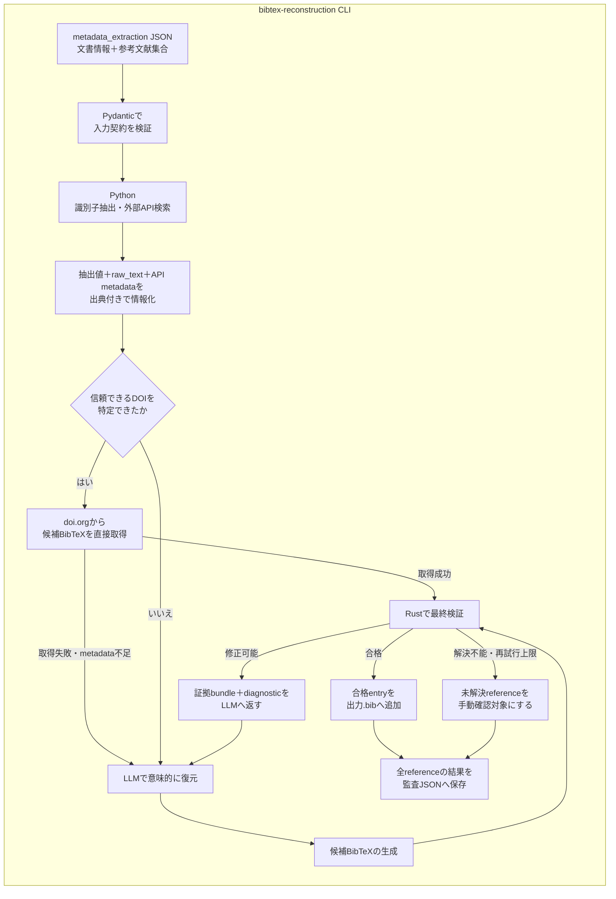

# BibTeX reconstruction

`bibtex_reconstruction`は，`metadata_extraction`が出力した文書・参考文献JSONから，外部APIとLLMで`.bib`を復元し，Rust実装で最終検証することで，登録候補となるBibTeX entryの集合を作る初期化専用CLIです．

一般利用のアプリ，backend，frontendとは独立しています．
このCLIはデータベースへ登録せず，Rust検証に合格した`.bib`と，全参考文献の処理経路・証拠・診断を含む監査用JSONを生成します．

## Architecture



入力JSONのrootには元文書の`title`，`authors`，`year`，`doi`，`abstract`と，`reference_count`，`references`を持たせます．各referenceには一意な`id`，抽出済みの`title`，`authors`，`year`，`doi`，`venue`と，元の引用文字列である`raw_text`を渡します．`reference_count`と配列長の不一致，重複ID，未定義fieldは入力契約のずれとして処理開始前に拒否します．

抽出済みfieldは確定値ではなく検索手掛かりとして扱います．`venue`には誌名だけでなく巻・号・pageなどが含まれる可能性があるため，正規化済みvenueとはみなしません．`raw_text`は抽出結果を検証・補完するための一次情報として常に証拠bundleへ残します．`2017a`，`2017b`のような年は元の値を保存しつつ，外部metadataとの照合時には`2017`として比較します．

元入力に正確なDOIが含まれる場合は曖昧検索とLLMを省略し，doi.orgのContent Negotiationから取得したBibTeXをRustへ直接送ります．

検索結果からDOIを採用する場合は，タイトル類似度が`trusted_doi_threshold`以上であり，既知の発行年と矛盾せず，入力と候補の著者トークンが少なくとも一つ一致することを要求します．

DOI候補とLLM候補は，`modern` policyの`bibmgr_native.validate_for_registration()`へ元sourceのまま渡します．このpipelineでは登録前の再serialize，safe fix，citation key変更を行いません．Rustのstrict parserとsemantic modelで保持可能かを確認し，候補のfield，大小文字，順序，delimiter，未知fieldを可能な限り保持します．

Rust検証で解決できない場合は，抽出済みfield，`raw_text`，全API候補とdiagnosticを出典付きの証拠bundleとしてLLMへ戻します．LLMによる明示的な再生成が`max_llm_attempts`回で合格しなければ手動確認対象にします．研究室ルールへの準拠やfieldの選択・順序・表記はこのpipelineの登録判定では扱わず，登録後の`laboratory` export profileによる検証・整形へ委ねます．

## Independence from the application

一般利用時の検索，登録，exportはこのdirectoryをimportしません．
通常登録で不正なBibTeXを拒否する責務は，アプリが利用する`bibmgr-*`のRust実装にあります．

初期化CLI内では`ready`と`manual_review`を処理結果として使いますが，これは初期化成果物の振り分け専用です．
一般アプリのrecordやAPI schemaへ`needs_review` flagを追加するものではありません．

## Directory responsibilities

- `main.py`: `metadata_extraction` JSONの入力，referenceの並列処理，合格entry集合と監査JSONの保存を行うCLIです．
- `services/source_loader.py`: JSONを読み込み，公開入力modelに適合するか検証します．
- `services/orchestrator.py`: DOI直通，並列検索，証拠bundle，LLM再試行，Rust検証を制御します．
- `services/semantic_reconstructor.py`: providerに依存しない証拠promptと修正promptを管理します．
- `services/llm_providers/`: Gemini，OpenAI，OpenAI互換APIへの接続差分とstructured outputを管理します．
- `api_clients/`: Crossref，Semantic Scholar，CiNii，J-STAGE，arXiv，doi.orgなどからmetadataまたはBibTeXを取得します．
- `core/source_clues.py`: 抽出済みfieldを検索手掛かりとして保持し，`raw_text`がBibTeXとして解釈できる場合だけ既存parserで欠損fieldを補完します．
- `core/native_validation.py`: Python側で検証規則や整形を再実装せず，Rustのsource-preservingな`modern`登録判定を呼び出します．
- `models/`: `metadata_extraction`との公開入出力契約と，API候補，証拠bundle，LLM結果，Rust diagnostic，各試行の監査情報を定義します．

## Setup

必要なPythonは3.12です．リポジトリルートからCLIの依存関係とRust extensionを同期します．

```bash
uv sync --project pipeline/bibtex_reconstruction --group dev
```

環境変数の雛形をコピーし，必要な値を設定します．

```bash
cp pipeline/bibtex_reconstruction/.env.sample pipeline/bibtex_reconstruction/.env
```

主な環境変数は次のとおりです．

- `BIBTEX_RECONSTRUCTION_LLM_PROVIDER`: 意味的復元に利用するproviderです．`gemini`，`openai`，`openai_compatible`から選択します．
- `BIBTEX_RECONSTRUCTION_LLM_MODEL`: providerへ渡すmodel名です．
- `BIBTEX_RECONSTRUCTION_LLM_API_KEY`: providerのAPI keyです．認証不要のlocal OpenAI互換serverでは空にできます．
- `BIBTEX_RECONSTRUCTION_LLM_BASE_URL`: OpenAI互換APIのbase URLです．`openai`では未指定時に公式endpointを使用します．
- `CROSSREF_MAILTO`: Crossrefのpolite poolを利用する連絡先．詳しくは[こちら](https://api.crossref.org/swagger-ui/index.html)
- `CINII_APPID`: CiNii APIのアプリケーションID．登録は[こちら](https://api.ci.nii.ac.jp/ja/)
- `SEMANTIC_SCHOLAR_API_KEY`: Semantic Scholar APIの認証に使用．登録は[こちら](https://www.semanticscholar.org/product/api#api-key-form)

選択したproviderの必須設定が不足していてもDOI直通経路は利用できますが，LLMが必要なreferenceは推測で補完せず`manual_review`へ送られます．

## Run

```bash
uv run --project pipeline/bibtex_reconstruction \
  python pipeline/bibtex_reconstruction/main.py \
  pipeline/bibtex_reconstruction/tests/test_input.json \
  --output reconstructed.bib \
  --report-output reconstruction-report.json
```

`--fail-on-review`を指定すると，手動確認対象が一件以上ある場合に終了status `2`を返します．CIや初期化scriptから完全自動処理できたかを判定する場合に利用できます．
従来の`--review-output`も`--report-output`のaliasとして利用できます．

## Outputs

`reconstructed.bib`にはRustの`modern`登録判定に合格したentryだけが入力順で格納されます．検証時にsourceを自動整形しないため，DOI providerまたはLLMが生成した表現を保持します．LLMが生成しただけの未検証entryは含まれません．研究室形式が必要な場合は，登録後に`laboratory` profileでexportします．

```bibtex
@article{example,
  author = {Doe, Jane},
  title = {An Example},
  journal = {Journal of Examples},
  year = {2025},
  doi = {10.1000/example}
}
```

`reconstruction-report.json`には元文書metadataと，全referenceの結果，検索証拠，候補，LLM試行，Rust diagnostic，必要な場合は手動確認理由が保存されます．`processed_references`に成功・失敗の両方を残すため，入力IDから各entryの処理経路を追跡できます．生成されたBibTeX entry自体をGitへ追加する必要はありません．

```json
{
  "schema_version": "1",
  "input_path": "metadata.json",
  "bibtex_output_path": "reconstructed.bib",
  "document": {
    "title": "Source document",
    "authors": ["Author One"]
  },
  "total_reference_count": 1,
  "reconstructed_count": 1,
  "manual_review_count": 0,
  "processed_references": [
    {
      "ref_id": "b0",
      "outcome": "ready"
    }
  ]
}
```

## Configuration

設定の既定値と型は`core/config.py`の`Settings`へ集約しています．
秘密情報や実行環境ごとの差分だけを`.env`で指定し，リポジトリ内の設定YAMLは使用しません．

主な調整項目は次のとおりです．

- `BIBTEX_RECONSTRUCTION_SIMILARITY_THRESHOLD`: 外部API候補を高類似候補とみなす閾値です．
- `BIBTEX_RECONSTRUCTION_TRUSTED_DOI_THRESHOLD`: 検索で発見したDOIをLLM省略経路へ送るためのタイトル類似度です．
- `BIBTEX_RECONSTRUCTION_MAX_PARALLEL_REQUESTS`: 同時に処理するreferenceまたは外部検索の上限です．
- `BIBTEX_RECONSTRUCTION_LLM_MAX_ATTEMPTS`: Rust diagnosticを使ったLLM修正の最大回数です．
API endpointやtimeoutも`BIBTEX_RECONSTRUCTION_`に`Settings`のfield名を大文字で続けることで上書きできますが，通常は変更不要です．

venueの省略名やexport形式はこのCLIでハードコードしません．登録後の出力はRustのexport profileと`config/registries/venues.toml`が担当します．

## Test

```bash
uv run --project pipeline/bibtex_reconstruction \
  pytest pipeline/bibtex_reconstruction/tests -q
```

テストでは，`metadata_extraction`出力に対する入力契約，件数・IDの整合性，検索手掛かりの補完，DOI直通によるLLM省略，検索DOIの整合確認，sourceを変更しないRust検証，diagnosticを使ったLLM再試行，手動確認への分離，全referenceを含む監査reportを検証します．
