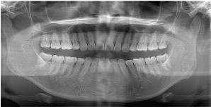
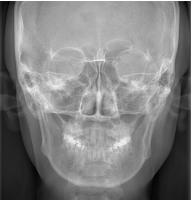
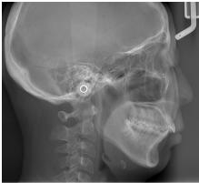

# 所見文書と X 線画像を用いた矯正歯科治療の自動診断

米山 瑛人 $ ^{1} $ 杉原 壮一郎 $ ^{1} $

梶原 智之 $ ^{1,2} $ 池田 直樹 $ ^{2} $ 佐田 明惟 $ ^{2} $ 谷川 千尋 $ ^{2} $

1 爱媛大学  $ ^{2} $ 大阪大学

{yoneyama@ai., sugihara@ai., kajiwara@}cs.ehime-u.ac.jp

{u725921b@ecs., u274168a@ecs., tanikawa.chihiro.dent@osaka-u.ac.jp

## 概要

本研究では，所見文書と X 線画像の両方を用いた矯正歯科治療の自動診断に取り組む．先行研究では所見文書の言語情報のみを使用しており，X 線画像等の画像情報を活用できていなかった．これに対して，我々は言語情報と画像情報を統合的に理解可能な視覚言語モデルを自動診断に活用する．実験の結果，所見文書のみを用いる先行研究と比較して，所見文書と X 線画像の両方を用いる本研究がより高い診断性能を達成し，矯正歯科治療の自動診断におけるマルチモーダル情報処理の有効性を確認できた．

## 1 はじめに

矯正歯科治療において，正確な診断を実現するためには，高度な専門知識や豊富な経験が必要である．そのため，経験の浅い歯科医師による問題の見落としや，専門医への業務集中が懸念される．

これらの課題に対して，先行研究 [1-5] では，所見文書を入力とするマルチラベルテキスト分類として矯正歯科治療の診断プロセスをタスク設計し，自然言語処理の技術を活用して自動診断に取り組んできた．具体的には，Support Vector Machine (SVM) 等を用いる機械学習の手法 [1] や Convolutional Neural Network (CNN) 等を用いる深層学習の手法 [2] が用いられてきた．近年は，大規模言語モデル (Large Language Model; LLM) を用いる自動診断 [3,4] にも取り組まれており，より高性能かつ汎用的な自動診断が可能となった．これらの先行研究では，10 年以上の経験を持つ専門医に匹敵する診断性能 [5] が確認されている．一方で，これらの先行研究では，矯正歯科治療において重要な診断材料である X 線画像（図 1）や顔画像等の画像情報を活用できていない．本研究では，視覚言語モデル (Vision Language Model; VLM) を用いて，所見文書と X 線画像の両方を入力とする矯正歯科治療のマルチモーダル自動診断

(a) パノラマ X 線画像

(b) 頭部正面 X 線画像

(c) 頭部側面 X 線画像

図1: 矯正歯科治療における X 線画像

断に取り組む．VLM とは，言語情報と画像情報を同一の表現空間で統合的に扱うことができるモデルであり，単一モダリティでは捉えにくい臨床的特徴を理解できるという特徴を有する．

実験の結果，所見文書のみを用いる LLM と比較して，所見文書と X 線画像の両方を用いる VLM がより高い性能を示すことを確認した．また，入力する X 線画像の種類によっては，32B の VLM で 72B の LLM の性能を上回り，矯正歯科治療の自動診断における画像情報の有効性が明らかになった．

## 2 関連研究

### 2.1 自然言語処理の医療応用

医療分野における自然言語処理の応用は，電子カルテや退院サマリ等の文書解析から診断支援まで幅広く進展している．代表的な医療言語処理モデルには，ClinicalBERT [6] や PubMedBERT [7] がある．近年は，LLM の医療応用も活発であり，PMC-Llama [8]