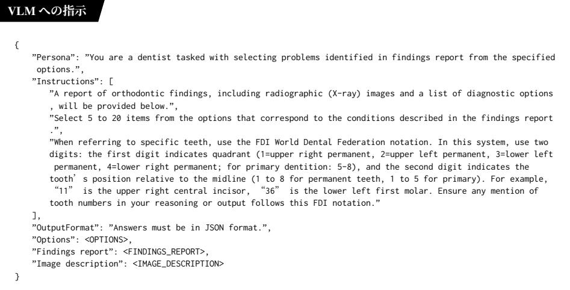

図2: VLMに与える指示

や Med-PaLM [9] が提案されている．さらに，VLM の活用により，医療テキストと医療画像を統合的に理解可能な MedGemma [10] や LLaVA-Med [11] も提案されている．一方で，矯正歯科治療に特化した LLM や VLM は存在せず，先行研究 [3,4] でも汎用 LLM のひとつである Qwen [12] が採用されている．

### 2.2 自然言語処理に基づく診断支援

眼科における診断支援の OphthalmicaMA2 [13] や，多様な医療画像からの疾患同定に活用できる MiniGPT-Med [11] など，診断支援においても LLM や VLM の活用が増えている．歯科領域においても，X 線画像や口腔内画像から口腔疾患の診断支援を行う DentVLM [14] や OralGPT [15] が提案されている．

矯正歯科治療においても，SVM 等の機械学習の手法 [1] や CNN 等の深層学習の手法 [2] を用いて，自動診断に取り組む先行研究がある．LLM の活用も進んでいる [3,4] が，これらの先行研究 [1-5] では重要な診断材料である X 線画像を活用しておらず，画像情報からしか得られない特徴を考慮できない．

## 3 矯正歯科治療の自動診断と VLM

本研究では，言語情報（所見文書）と画像情報（X線画像）を統合的に理解可能な VLM を活用し，矯正歯科治療のマルチモーダル自動診断に取り組む。

### 3.1 VLM に与える指示文の構成

VLM に与える指示文は，図２に示すように，ペルソナやタスクの説明，出力形式，症状リスト，所見文書，画像説明で構成する．先行研究 [3] では，日本語の所見文書を扱う場合でも英語の指示文や英語の症状リストを与えることが有効であり，指示文はJSON形式[16]が適していることを報告している．そこで本研究でも，JSON形式かつ英語の指示文を採用し，症状リストは日本語と英語を併記する．また，先行研究[4]では，所見文書や症状リストに含まれる専門用語を一般的かつ平易な表現に言い換えることで診断性能が向上することも報告されている．そこで本研究でも，先行研究と同じ言い換え辞書を用いて専門用語を平易化し，所見文書においては専門用語と平易な表現を置換し，症状リストにおいては症状名と平易な説明を併記する．

### 3.2 言語に関する工夫：専門知識の補足

所見文書では，歯を参照する際に FDI 方式 $ ^{1} $[17]の歯式が用いられている．VLM の事前訓練データには歯科矯正学に特化したテキストが充分に含まれているとは限らないため，FDI 表記の理解を促進す