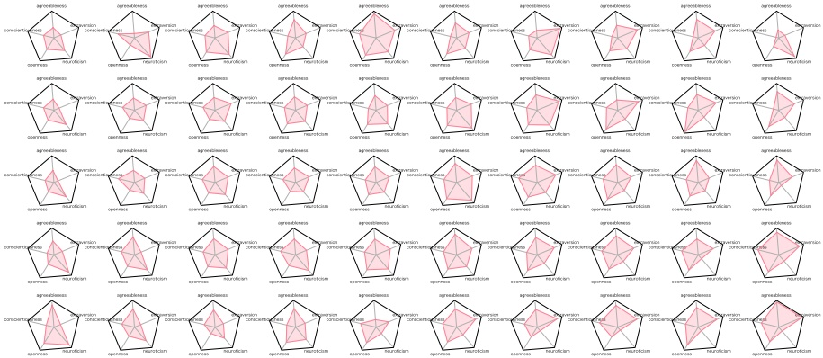

Figure 1: Results of personality diagnosis. Clockwise from top: agreeableness, extraversion, neuroticism, openness, conscientiousness.

<table border=1 style='margin: auto; word-wrap: break-word;'><tr><td style='text-align: center; word-wrap: break-word;'>Text</td><td colspan="9">Today is the perfect weather. I&#x27;ll clean and play.</td></tr><tr><td style='text-align: center; word-wrap: break-word;'>Writer</td><td style='text-align: center; word-wrap: break-word;'>joy: 3</td><td style='text-align: center; word-wrap: break-word;'>sadness: 0</td><td style='text-align: center; word-wrap: break-word;'>anticipation: 3</td><td style='text-align: center; word-wrap: break-word;'>surprise: 0</td><td style='text-align: center; word-wrap: break-word;'>anger: 0</td><td style='text-align: center; word-wrap: break-word;'>fear: 0</td><td style='text-align: center; word-wrap: break-word;'>disgust: 0</td><td style='text-align: center; word-wrap: break-word;'>trust: 1</td><td style='text-align: center; word-wrap: break-word;'></td></tr><tr><td style='text-align: center; word-wrap: break-word;'>Reader 1</td><td style='text-align: center; word-wrap: break-word;'>joy: 3</td><td style='text-align: center; word-wrap: break-word;'>sadness: 0</td><td style='text-align: center; word-wrap: break-word;'>anticipation: 3</td><td style='text-align: center; word-wrap: break-word;'>surprise: 0</td><td style='text-align: center; word-wrap: break-word;'>anger: 0</td><td style='text-align: center; word-wrap: break-word;'>fear: 0</td><td style='text-align: center; word-wrap: break-word;'>disgust: 0</td><td style='text-align: center; word-wrap: break-word;'>trust: 0</td><td style='text-align: center; word-wrap: break-word;'></td></tr><tr><td style='text-align: center; word-wrap: break-word;'>Reader 2</td><td style='text-align: center; word-wrap: break-word;'>joy: 2</td><td style='text-align: center; word-wrap: break-word;'>sadness: 0</td><td style='text-align: center; word-wrap: break-word;'>anticipation: 2</td><td style='text-align: center; word-wrap: break-word;'>surprise: 0</td><td style='text-align: center; word-wrap: break-word;'>anger: 0</td><td style='text-align: center; word-wrap: break-word;'>fear: 0</td><td style='text-align: center; word-wrap: break-word;'>disgust: 0</td><td style='text-align: center; word-wrap: break-word;'>trust: 0</td><td style='text-align: center; word-wrap: break-word;'></td></tr><tr><td style='text-align: center; word-wrap: break-word;'>Reader 3</td><td style='text-align: center; word-wrap: break-word;'>joy: 3</td><td style='text-align: center; word-wrap: break-word;'>sadness: 0</td><td style='text-align: center; word-wrap: break-word;'>anticipation: 3</td><td style='text-align: center; word-wrap: break-word;'>surprise: 0</td><td style='text-align: center; word-wrap: break-word;'>anger: 0</td><td style='text-align: center; word-wrap: break-word;'>fear: 0</td><td style='text-align: center; word-wrap: break-word;'>disgust: 0</td><td style='text-align: center; word-wrap: break-word;'>trust: 0</td><td style='text-align: center; word-wrap: break-word;'></td></tr><tr><td style='text-align: center; word-wrap: break-word;'>Text</td><td colspan="9">The tire of my car was flat. I heard that it might be mischief.</td></tr><tr><td style='text-align: center; word-wrap: break-word;'>Writer</td><td style='text-align: center; word-wrap: break-word;'>joy: 0</td><td style='text-align: center; word-wrap: break-word;'>sadness: 3</td><td style='text-align: center; word-wrap: break-word;'>anticipation: 0</td><td style='text-align: center; word-wrap: break-word;'>surprise: 1</td><td style='text-align: center; word-wrap: break-word;'>anger: 3</td><td style='text-align: center; word-wrap: break-word;'>fear: 0</td><td style='text-align: center; word-wrap: break-word;'>disgust: 0</td><td style='text-align: center; word-wrap: break-word;'>trust: 0</td><td style='text-align: center; word-wrap: break-word;'></td></tr><tr><td style='text-align: center; word-wrap: break-word;'>Reader 1</td><td style='text-align: center; word-wrap: break-word;'>joy: 0</td><td style='text-align: center; word-wrap: break-word;'>sadness: 3</td><td style='text-align: center; word-wrap: break-word;'>anticipation: 0</td><td style='text-align: center; word-wrap: break-word;'>surprise: 3</td><td style='text-align: center; word-wrap: break-word;'>anger: 1</td><td style='text-align: center; word-wrap: break-word;'>fear: 2</td><td style='text-align: center; word-wrap: break-word;'>disgust: 1</td><td style='text-align: center; word-wrap: break-word;'>trust: 0</td><td style='text-align: center; word-wrap: break-word;'></td></tr><tr><td style='text-align: center; word-wrap: break-word;'>Reader 2</td><td style='text-align: center; word-wrap: break-word;'>joy: 0</td><td style='text-align: center; word-wrap: break-word;'>sadness: 2</td><td style='text-align: center; word-wrap: break-word;'>anticipation: 0</td><td style='text-align: center; word-wrap: break-word;'>surprise: 2</td><td style='text-align: center; word-wrap: break-word;'>anger: 0</td><td style='text-align: center; word-wrap: break-word;'>fear: 0</td><td style='text-align: center; word-wrap: break-word;'>disgust: 0</td><td style='text-align: center; word-wrap: break-word;'>trust: 0</td><td style='text-align: center; word-wrap: break-word;'></td></tr><tr><td style='text-align: center; word-wrap: break-word;'>Reader 3</td><td style='text-align: center; word-wrap: break-word;'>joy: 0</td><td style='text-align: center; word-wrap: break-word;'>sadness: 2</td><td style='text-align: center; word-wrap: break-word;'>anticipation: 0</td><td style='text-align: center; word-wrap: break-word;'>surprise: 2</td><td style='text-align: center; word-wrap: break-word;'>anger: 0</td><td style='text-align: center; word-wrap: break-word;'>fear: 1</td><td style='text-align: center; word-wrap: break-word;'>disgust: 1</td><td style='text-align: center; word-wrap: break-word;'>trust: 0</td><td style='text-align: center; word-wrap: break-word;'></td></tr></table>

Table 3: Examples of our dataset.

a substantial agreement ( $ \kappa > 0.6 $), but trust, is with a fair agreement ( $ \kappa < 0.4 $). Overall, we confirmed a moderate agreement ( $ 0.5 < \kappa < 0.6 $) among the objective annotators.

The lower part of Table 2 shows the agreement between the subjective and the objective annotators. These are discussed in Section 4.2.

### 3.3 Writers' Personality Assessment

We also performed personality assessments of our writers (i.e., subjective annotators) in order to explore the relationship between personality and emotion. Through 60 questions (Saito et al., 2001) based on the Big Five personality traits (Goldberg, 1992), the following five factors were assessed: agreeableness, extraversion, neuroticism, openness, and conscientiousness. In this personality assessment, the writer's own applicability to each of 60 adjectives, such as "cheerful" and "honest" is reported on a 7-point scale, and the five factors of personality indicators are derived.

Figure 1 shows the results of the personality assessment over all 50 writers, where we can see various personalities. For example, well-balanced writers can be seen near the center of the figure, and writers with low neuroticism appear in the lower right. In Section 5, we shall show how the personality helps to improve emotional intensity estimation.

## 4 Analysis

Table 3 shows some examples of labeled posts in our dataset. The first post was written with a strong emotions of both joy and anticipation. Readers can have similar emotions as the writer for this post. The second post was written with a strong emotions of both sadness and anger. Readers can share emotions of sadness, but they are more surprised than angry.